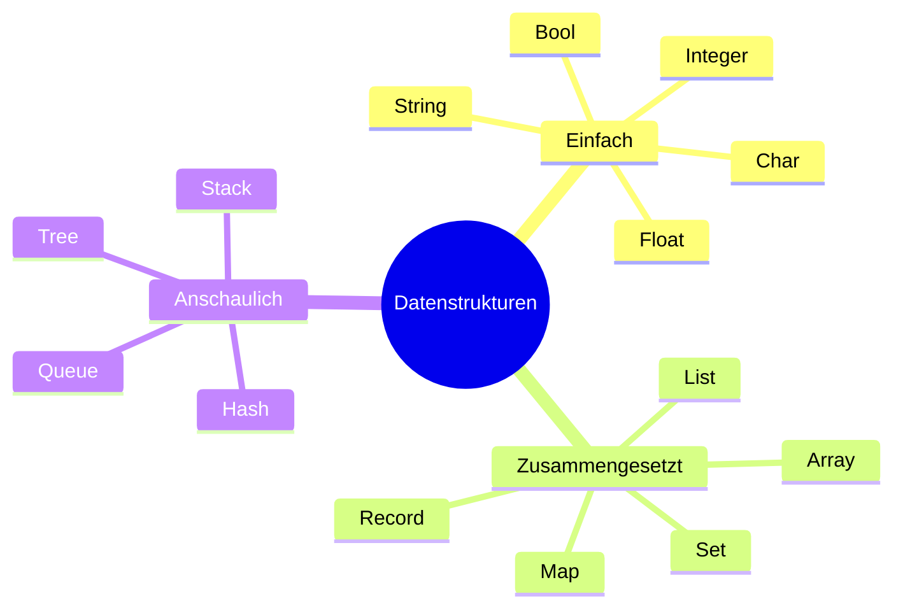

# Datenstrukturen

## Überblick



## Einfache Datentypen

Einfache Datentypen speichern einen einzelnen Wert.

| Typ | Beschreibung | Beispiel |
|---|---|---|
| `int` | Ganzzahl | `42` |
| `float` / `double` | Kommazahl | `3.14` |
| `String` | Zeichenkette | `"Hallo"` |
| `char` | Einzelnes Zeichen | `'A'` |
| `boolean` | Wahrheitswert | `true`, `false` |

## Zusammengesetzte Datentypen

Zusammengesetzte Typen fassen mehrere Werte zusammen.

| Typ | Beschreibung |
|---|---|
| Array | Feste Anzahl von Elementen desselben Typs, direkter Zugriff per Index |
| List | Dynamische Folge von Elementen, Einfügen und Löschen möglich |
| Record | Zusammenfassung verschiedener Typen unter einem Namen (in Java: Klasse oder Record) |
| Set | Menge ohne Duplikate, keine garantierte Reihenfolge |
| Map | Schlüssel-Wert-Paare, Zugriff über Schlüssel |

## Anschauliche Datenstrukturen

Diese Strukturen beschreiben, wie Daten verwaltet werden — nicht nur gespeichert.

| Struktur | Analogie | Verhalten |
|---|---|---|
| Queue | Warteschlange | First In, First Out (FIFO) |
| Stack | Bücherstapel | Last In, First Out (LIFO) |
| Hash | Wörterbuch / Index | Direkter Zugriff über Schlüssel, sehr schnell |
| Tree | Stammbaum | Hierarchische Struktur mit Eltern- und Kindknoten |

Weiterführend: [Queue](https://de.wikipedia.org/wiki/Warteschlange_(Datenstruktur)) · [Stack](https://de.wikipedia.org/wiki/Stapelspeicher) · [Hashtabelle](https://de.wikipedia.org/wiki/Hashtabelle) · [Baum](https://de.wikipedia.org/wiki/Baum_(Datenstruktur))

### Stack — Ablauf (LIFO)

```
Push A  →  [ A ]
Push B  →  [ A, B ]
Push C  →  [ A, B, C ]
Pop     →  [ A, B ]     Ergebnis: C  ← zuletzt rein, zuerst raus
Pop     →  [ A ]        Ergebnis: B
```

Analogie: Ein Stapel Bücher — man nimmt immer das oberste.

### Queue — Ablauf (FIFO)

```
Enqueue A  →  [ A ]
Enqueue B  →  [ A, B ]
Enqueue C  →  [ A, B, C ]
Dequeue    →  [ B, C ]     Ergebnis: A  ← zuerst rein, zuerst raus
Dequeue    →  [ C ]        Ergebnis: B
```

Analogie: Eine Warteschlange — wer zuerst kommt, wird zuerst bedient.

## Wann welche Datenstruktur?

| Situation | Geeignete Struktur |
|---|---|
| Reihenfolge wichtig, feste Größe | Array |
| Reihenfolge wichtig, variable Größe | List |
| Schnelle Suche über Schlüssel | Map / Hash |
| Keine Duplikate erlaubt | Set |
| Verarbeitung in Reihenfolge des Eintreffens | Queue |
| Rückgängig-Funktion oder verschachtelter Aufruf | Stack |
| Hierarchische Daten (Ordner, Kategorien) | Tree |
