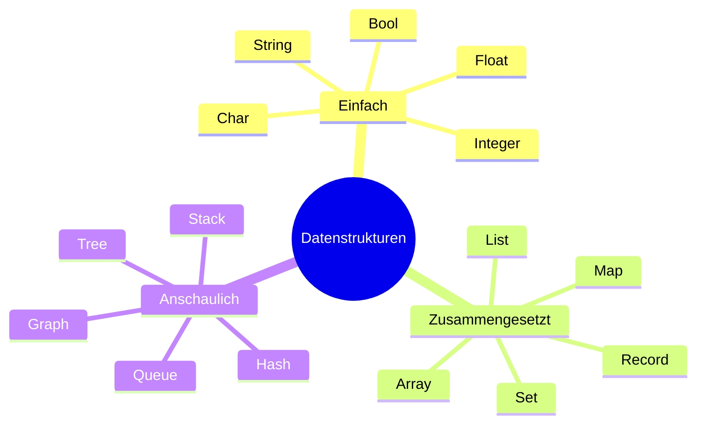

# Datenstrukturen

## Überblick



## Einfache Datentypen

Einfache Datentypen speichern einen einzelnen Wert.

| Typ | Beschreibung | Beispiel |
|---|---|---|
| `int` | Ganzzahl | `42` |
| `float` / `double` | Kommazahl | `3.14` |
| `String` | Zeichenkette | `"Hallo"` |
| `char` | Einzelnes Zeichen | `'A'` |
| `boolean` | Wahrheitswert | `true`, `false` |

## Zusammengesetzte Datentypen

Zusammengesetzte Typen fassen mehrere Werte zusammen.

| Typ | Beschreibung |
|---|---|
| Array | Feste Anzahl von Elementen desselben Typs, direkter Zugriff per Index |
| List | Dynamische Folge von Elementen, Einfügen und Löschen möglich |
| Record | Zusammenfassung verschiedener Typen unter einem Namen (in Java: Klasse oder Record) |
| Set | Menge ohne Duplikate, keine garantierte Reihenfolge |
| Map | Schlüssel-Wert-Paare, Zugriff über Schlüssel |

## Anschauliche Datenstrukturen

Diese Strukturen beschreiben, wie Daten verwaltet werden — nicht nur gespeichert.

| Struktur | Analogie | Verhalten |
|---|---|---|
| Queue | Warteschlange | First In, First Out (FIFO) |
| Stack | Bücherstapel | Last In, First Out (LIFO) |
| Hash | Wörterbuch / Index | Direkter Zugriff über Schlüssel, sehr schnell |
| Tree | Stammbaum | Hierarchische Struktur mit Eltern- und Kindknoten |
| Graph | Straßennetz / Netzwerk | Knoten verbunden durch Kanten, gerichtet oder ungerichtet |

Weiterführend: [Queue](https://de.wikipedia.org/wiki/Warteschlange_(Datenstruktur)) · [Stack](https://de.wikipedia.org/wiki/Stapelspeicher) · [Hashtabelle](https://de.wikipedia.org/wiki/Hashtabelle) · [Baum](https://de.wikipedia.org/wiki/Baum_(Datenstruktur))

### Stack — Ablauf (LIFO)

```
Push A  →  [ A ]
Push B  →  [ A, B ]
Push C  →  [ A, B, C ]
Pop     →  [ A, B ]     Ergebnis: C  ← zuletzt rein, zuerst raus
Pop     →  [ A ]        Ergebnis: B
```

Analogie: Ein Stapel Bücher — man nimmt immer das oberste.

### Queue — Ablauf (FIFO)

```
Enqueue A  →  [ A ]
Enqueue B  →  [ A, B ]
Enqueue C  →  [ A, B, C ]
Dequeue    →  [ B, C ]     Ergebnis: A  ← zuerst rein, zuerst raus
Dequeue    →  [ C ]        Ergebnis: B
```

Analogie: Eine Warteschlange — wer zuerst kommt, wird zuerst bedient.

### Linked List — Aufbau

```
[ A ] → [ B ] → [ C ] → [ D ] → null
```

Jedes Element (Knoten) enthält einen Wert und einen Zeiger auf das nächste Element. Im Gegensatz zum Array sind Elemente nicht zusammenhängend im Speicher — Einfügen und Löschen ist an beliebiger Stelle schnell, direkter Index-Zugriff aber langsam.

### Binärbaum — Aufbau

```
        [ 8 ]
       /     \
    [ 3 ]   [ 10 ]
    /   \       \
 [ 1 ] [ 6 ]  [ 14 ]
        / \    /
      [4] [7] [13]
```

- Jeder Knoten hat maximal zwei Kinder (links, rechts)
- Im Binary Search Tree (BST): linkes Kind < Elternknoten < rechtes Kind
- Suche, Einfügen, Löschen in O(log n) — deutlich schneller als lineare Suche

### Graph — Aufbau

```
  A --- B
  |   / |
  |  /  |
  C --- D
```

- **Knoten (Nodes):** einzelne Datenpunkte (A, B, C, D)
- **Kanten (Edges):** Verbindungen zwischen Knoten
- **Ungerichtet (`—`):** Verbindung gilt in beide Richtungen
- **Gerichtet (`→`):** Verbindung gilt nur in eine Richtung (z. B. Einbahnstraße)
- Anwendungen: Routenplanung, soziale Netzwerke, Paketabhängigkeiten

## Zeitkomplexität im Vergleich

Wie schnell ist eine Operation? Angabe in [Big-O-Notation](https://de.wikipedia.org/wiki/Landau-Symbole) (Worst Case).

| Struktur | Zugriff | Suche | Einfügen | Löschen |
|---|---|---|---|---|
| Array | O(1) | O(n) | O(n) | O(n) |
| Linked List | O(n) | O(n) | O(1)* | O(1)* |
| Stack | — | O(n) | O(1) | O(1) |
| Queue | — | O(n) | O(1) | O(1) |
| Hash / Map | O(1) | O(1) | O(1) | O(1) |
| Binärbaum (BST) | O(log n) | O(log n) | O(log n) | O(log n) |

\* bei bekannter Position

## Wann welche Datenstruktur?

| Situation | Geeignete Struktur |
|---|---|
| Reihenfolge wichtig, feste Größe | Array |
| Reihenfolge wichtig, variable Größe | List |
| Schnelle Suche über Schlüssel | Map / Hash |
| Keine Duplikate erlaubt | Set |
| Verarbeitung in Reihenfolge des Eintreffens | Queue |
| Rückgängig-Funktion oder verschachtelter Aufruf | Stack |
| Hierarchische Daten (Ordner, Kategorien) | Tree |
| Netzwerke, Routen, Beziehungen zwischen Objekten | Graph |
| Viele Einfüge-/Löschoperationen, kein Index-Zugriff nötig | Linked List |
