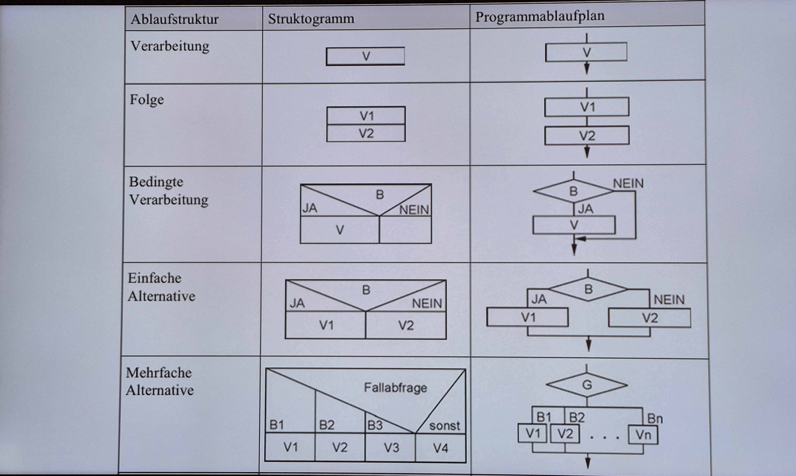
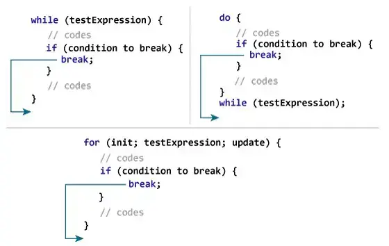
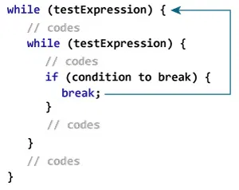
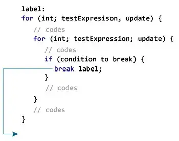
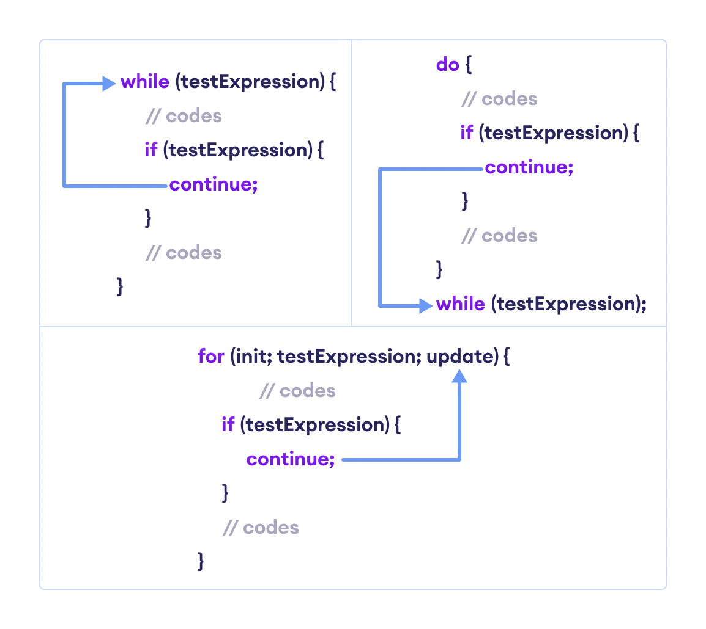
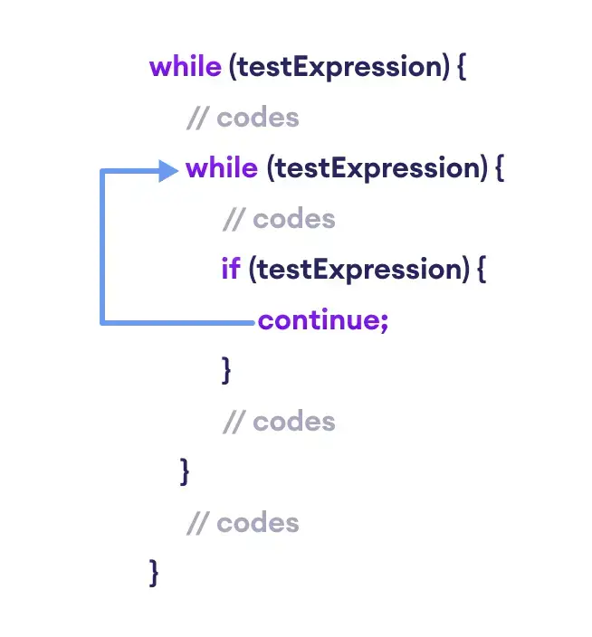
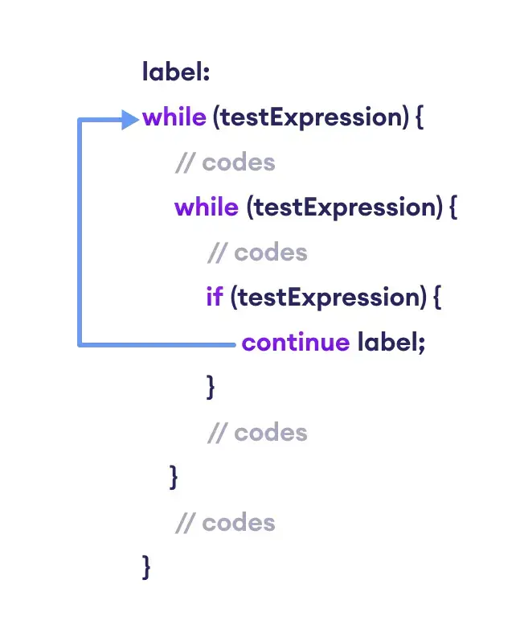

# Kontrollstrukturen

Kontrollstrukturen bestimmen den Ablauf eines Programms. Es gibt drei Grundstrukturen (siehe [Phasenmodell](phasenmodell.md)).

## Algorithmus

Ein **Algorithmus** ist eine eindeutige, endliche Schrittfolge zur Lösung eines Problems.

### Merkmale

| Merkmal | Bedeutung |
|---|---|
| Endlich | Besteht aus einer begrenzten Anzahl von Schritten |
| Eindeutig | Jeder Schritt ist klar und unmissverständlich definiert |
| Deterministisch | Bei gleichen Eingaben immer das gleiche Ergebnis |
| Terminiert | Kommt nach endlicher Zeit zu einem Ende |
| Ausführbar | Jeder Schritt ist tatsächlich durchführbar |

### Bausteine

Jeder Algorithmus besteht aus einer Kombination von:

- **Sequenzen** — Abfolgen von Anweisungen
- **Verzweigungen** — Bedingungen (Ja/Nein)
- **Schleifen** — Wiederholungen

## PAP — Programmablaufplan

Ein PAP ist eine **grafische Darstellung von Programmabläufen** mit genormten Symbolen. Er wird verwendet, um Algorithmen vor der Implementierung zu planen und zu visualisieren.

### Symbole

| Symbol | Name | Verwendung |
|---|---|---|
| Rechteck | Verarbeitung | Anweisung oder Berechnung |
| Parallelogramm | Ein-/Ausgabe | Daten einlesen oder ausgeben |
| Raute | Verzweigung | Bedingung mit Ja/Nein-Zweig |
| Oval / abgerundetes Rechteck | Grenzstelle | Start oder Ende des Programms |
| Kleiner Kreis | Verbinder | Verbindet zwei Stellen im Plan (z. B. Seitenumbruch) |
| Rechteck mit doppelten Seitenlinien | Unterprogramm | Aufruf eines Teilprogramms |
| Trapez | Manuelle Verarbeitung | Manueller Eingriff (z. B. Benutzereingabe) |

### Tools

| Tool | Plattform |
|---|---|
| PAP Designer | Windows |
| [app.diagrams.net](https://app.diagrams.net) | Web |



## Warum PAP und Struktogramm?

Beide Darstellungsformen beschreiben denselben Algorithmus — aus unterschiedlichen Perspektiven.

| | PAP (Programmablaufplan) | Struktogramm (Nassi-Shneidermann) |
|---|---|---|
| **Entstehung** | 1930er Jahre; in den 1960ern standardisiert | 1970er Jahre, als Reaktion auf "Spaghetti-Code" |
| **Ausrichtung** | Flussorientiert — folgt dem Kontrollfluss | Blockorientiert — zeigt die Struktur des Codes |
| **Zweck** | Visualisierung von Prozessen und einfachen Algorithmen | Erzwingt strukturierte Programmierung (nur erlaubte Kontrollstrukturen) |
| **Heute** | Noch gelegentlich in der Industrie | Kaum noch in Verwendung, eher in der Schule |

In der modernen Softwareentwicklung hat **UML** (Unified Modeling Language) beide weitgehend abgelöst — mit speziellen Diagrammtypen für Klassenstrukturen, Abläufe, Zustände und mehr.

> **Prüfungsrelevant:** Die Umwandlung PAP → Struktogramm und Struktogramm → PAP kommt zum Test. Beide Richtungen üben.

## Sequenz (Anweisungsfolge)

Anweisungen werden der Reihe nach ausgeführt.

```java
// Fläche eines Rechtecks berechnen
int breite = 5;
int hoehe = 3;
int flaeche = breite * hoehe;
```

## Selektion (Auswahlstruktur)

### Einfache Alternative

```java
// Note ausgeben
if (punkte >= 90) {
    System.out.println("Sehr gut");
} else if (punkte >= 75) {
    System.out.println("Gut");
} else {
    System.out.println("Nicht bestanden");
}
```

### Mehrfache Alternative

```java
// Wochentag ausgeben
switch (tag) {
    case 1:
        System.out.println("Montag");
        break;
    case 2:
        System.out.println("Dienstag");
        break;
    default:
        System.out.println("Anderer Tag");
        break;
}
```

`switch` eignet sich, wenn eine Variable gegen mehrere feste Werte geprüft wird. `if-else` ist flexibler und erlaubt beliebige Bedingungen.

## Zusammengesetzte Bedingungen

Eine Bedingung ist immer entweder `true` oder `false`. Mit logischen Operatoren lassen sich mehrere Bedingungen verknüpfen:

| Operator | Name | Bedeutung |
|---|---|---|
| `&&` | Logisches UND | `true`, wenn **beide** Bedingungen `true` sind |
| `\|\|` | Logisches ODER | `true`, wenn **mindestens eine** Bedingung `true` ist |
| `!` | Logisches NICHT | Kehrt den Wahrheitswert um |

```java
// ((B1 && B2) || B3)
boolean b1 = punkte >= 50;
boolean b2 = anwesenheit >= 80;
boolean b3 = sondergenehmigung;

if ((b1 && b2) || b3) {
    System.out.println("Bestanden");
}
```

### Auswertungsreihenfolge

Java wertet zusammengesetzte Bedingungen in dieser Reihenfolge aus:

1. `!` — zuerst
2. `&&` — dann
3. `||` — zuletzt

Bei `B1 && B2 || B3 && !B4` wird also zuerst `!B4` ausgewertet, dann beide `&&`-Verbindungen, dann das `||`. **Klammernsetzung schadet nicht** — gerade wenn es komplexer wird, macht eine explizite Klammer die Absicht sofort klar.

### Praxisbeispiele

**Einlasskontrolle (UND-Logik):** Beide Bedingungen müssen erfüllt sein.

```java
// Über 18 AND (Ticket OR Gästeliste)
if (alter >= 18 && (hatTicket || stehtAufGaesteliste)) {
    System.out.println("Einlass gewährt");
}
```

**Ausnahmeregel (ODER-Logik):** Es wird nach *einem Grund* gesucht, jemanden reinzulassen — sobald einer gefunden ist, wird abgebrochen.

```java
// Besitzer OR Gästeliste OR Ticket
if (istBesitzer || stehtAufGaesteliste || hatTicket) {
    System.out.println("Einlass gewährt");
} else {
    System.out.println("Kein Einlass");
}
```

**Null-Check bei ArrayList:** Die Reihenfolge kann einen Unterschied machen — nicht nur logisch, sondern auch für die Stabilität des Programms.

```java
ArrayList<String> list = new ArrayList<>();

// FALSCH — wenn list null ist, wirft list.size() eine NullPointerException
// bevor die null-Prüfung überhaupt erreicht wird:
if (list.size() > 0 && list != null) { ... }

// RICHTIG — null zuerst prüfen:
if (list != null && list.size() > 0) { ... }
```

Java wertet `&&` von links nach rechts aus (*Short-Circuit-Evaluation*): Ist die linke Seite `false`, wird die rechte gar nicht mehr ausgewertet. Das spart Zeit — und verhindert Fehler. Bei `||` gilt das Gleiche in die andere Richtung — ist die linke Seite bereits `true`, wird die rechte übersprungen.

**Spielkauf (kombinierte Logik):** Bedingungen mit `&&` und `||` lassen sich verschachteln. Short-Circuit greift auf beiden Ebenen:

```java
// Kaufen erlaubt, wenn: (Alter > 16 UND Spiel nicht indiziert) ODER Zertifikat vorhanden
if ((alter > 16 && !aufIndex) || hatZertifikat) {
    kaufen();
} else {
    nichtKaufen();
}
// Sobald hatZertifikat == true, wird (alter > 16 && !aufIndex) gar nicht mehr geprüft.
```

### Entscheidungstabellen

Entscheidungstabellen sind das **mächtigste Mittel**, um komplexe Abhängigkeiten zwischen Bedingungen und Aktionen **übersichtlich, vollständig und widerspruchsfrei** darzustellen. Sie zeigen auf einen Blick, welche Kombinationen welche Aktionen auslösen — und ob es Lücken oder Widersprüche gibt.

**Vorgehensweise:**
1. Bedingungen und Aktionen identifizieren *(Hilfsschritt: WENN-DANN-Sätze bilden)*
2. Reihenfolge der Bedingungen festlegen
3. Logisches Raster erstellen
4. Aktionen zuordnen (inkl. additive Aktionen)
5. Optimierung durchführen (Regeln zusammenfassen)
6. Else-Regel anwenden

#### Schritt 1: Bedingungen und Aktionen erkennen

**Bedingungen** beschreiben einen Zustand oder eine Tatsache — meist mit Ja/Nein beantwortbar. Signalwörter im Text:

| Typ | Beispiele |
|---|---|
| Status-Wörter | „ist angemeldet", „hat bezahlt", „vorhanden", „gültig" |
| Vergleichs-Wörter | „größer als", „mindestens", „unter", „maximal" |
| Einleitungs-Wörter | „Falls", „Wenn", „Ist", „Sofern", „Unter der Bedingung, dass" |

*Beispiel: „Wenn der Kunde eine Kundenkarte hat…" → Bedingung: Kunde hat Kundenkarte*

**Aktionen** beschreiben, was das System tut, nachdem eine Bedingung erfüllt ist. Signalwörter:

| Typ | Beispiele |
|---|---|
| Befehls-Wörter (Verben) | „berechnen", „drucken", „anzeigen", „sperren", „versenden" |
| Ergebnis-Wörter | „Rabatt von 5 %", „Zulassung erteilt", „Fehlermeldung 404" |
| Einleitungs-Wörter | „…dann…", „…erfolgt…", „…muss…" |

*Beispiel: „…dann gewähren wir 5 % Rabatt" → Aktion: 5 % Rabatt gewähren*

#### Hilfsschritt: WENN-DANN-Sätze

Um sicherzugehen, dass keine Bedingung vergessen wurde, lässt sich die Logik in WENN-DANN-Sätze übersetzen:

```
WENN [Bedingung] DANN [Aktion]
WENN [Bedingung 1] UND/ODER/NICHT [Bedingung 2] DANN [Aktion]
```

*Beispiel: WENN Fahrgast unter 6 Jahre alt ist DANN fährt er gratis*

Dieser Hilfsschritt ist optional, schadet aber nicht — er deckt Lücken auf, bevor die Tabelle gebaut wird.

#### Schritt 2: Reihenfolge der Bedingungen festlegen

Die Reihenfolge bestimmt, wie effizient und lesbar die Tabelle wird. Es gibt zwei Prinzipien:

| Prinzip | Bedeutung | Beispiel |
|---|---|---|
| **Dominanz** | Eine Bedingung macht alle anderen überflüssig → kommt nach oben | Sturmwarnung → Lift gesperrt, egal was sonst gilt |
| **Reihenfolge** | Bedingungen bauen aufeinander auf → logische Kette | Erst Konto prüfen, dann Kontostand prüfen |

> „Die Bedingung, die andere Bedingungen überflüssig (*Don't Care*) macht, gehört nach oben. Saubere Logik fließt von oben (wichtig/allgemein) nach unten (spezifisch/Detail)."

**Übung — Skilift:** *„Kinder unter 10 Jahren freier Eintritt. Senioren ab 65 Jahren Rabatt. Alle anderen voller Preis. Bei Sturmwarnung bleibt der Lift für alle geschlossen."*
→ Dominante Bedingung nach oben: **Sturmwarnung?** — wenn Ja, alle anderen Bedingungen egal.

**Übung — Paketausgabe:** *„Paket wird nur ausgegeben, wenn der Kunde einen gültigen Abholcode besitzt. Bei Nachnahme erst nach Zahlung."*
→ Dominante Bedingung nach oben: **Code gültig?** — wenn Nein, alles andere egal.

**Übung — Prüfungszulassung:** *„Zulassung wenn ≥ 80 % der Hausübungen abgegeben. Wer weniger hat, aber eine ärztliche Entschuldigung, wird ebenfalls zugelassen. Ohne beides keine Zulassung."*
→ Zwei Wege zur Zulassung — hier muss man selbst entscheiden, welche Bedingung wichtiger ist.

#### Schritt 3: Logisches Raster erstellen

**Formel für Ja/Nein-Bedingungen:** 2^n (n = Anzahl der Bedingungen).

Das Raster systematisch von oben nach unten befüllen: Oberste Zeile n/2 × J, dann n/2 × N — jede weitere Zeile halbiert den Rhythmus:

```
2 Bedingungen → 4 Regeln:
  J J N N
  J N J N

3 Bedingungen → 8 Regeln:
  J J J J N N N N
  J J N N J J N N
  J N J N J N J N
```

**Gemischte Wertebereiche:** Produkt aller Varianten — z.B. 2 × Ja/Nein-Bedingungen + 1 × A/B/C-Bedingung: 2² × 3 = 12 Regeln. Das Befüllen folgt demselben Prinzip mit angepasster Schrittweite.

#### Schritt 4: Aktionen zuordnen

Jede Spalte ist ein Testfall. Von oben nach unten lesen, mit den WENN-DANN-Sätzen abgleichen, dann Kreuz setzen. Kein Kreuz = keine Aktion bei dieser Kombination.

**Additive Aktionen:** Eine Bedingungskombination kann mehrere Aktionen gleichzeitig auslösen → mehrere Kreuze in einer Spalte.

*Beispiel Bankomat: Kontostand ausreichend → Geldscheine ausgeben **+** Beleg drucken **+** Kontostand aktualisieren **+** Karte zurückgeben.*

#### Vollständiges Beispiel: Fahrtpreis

*„Ein Ticket kostet 10 €. Wer eine Rabattkarte besitzt, zahlt nur die Hälfte. Kinder unter 6 Jahren fahren grundsätzlich gratis — egal ob Rabattkarte oder nicht."*

Bedingungen und Aktionen identifizieren:
- B1: Fahrgast < 6 Jahre? *(dominant — macht Rabattkarte irrelevant)*
- B2: Fahrgast hat Rabattkarte?
- Aktionen: Gratis | 5 € | 10 €

WENN-DANN-Sätze:
- WENN Fahrgast < 6 Jahre DANN gratis
- WENN Fahrgast ≥ 6 Jahre UND Rabattkarte DANN 5 €
- WENN Fahrgast ≥ 6 Jahre UND keine Rabattkarte DANN 10 €

**Vollständige Tabelle (2² = 4 Regeln):**

| Bedingungen             | R1 | R2 | R3 | R4 |
|---|---|---|---|---|
| B1: Fahrgast < 6 Jahre? | J  | J  | N  | N  |
| B2: Rabattkarte?        | J  | N  | J  | N  |
| **Gratis**              | x  | x  |    |    |
| **5 €**                 |    |    | x  |    |
| **10 €**                |    |    |    | x  |

**Nach Optimierung** — R1 und R2 führen zur gleichen Aktion und unterscheiden sich nur in B2 → Don't Care:

| Bedingungen             | R1/R2 | R3 | R4 |
|---|---|---|---|
| B1: Fahrgast < 6 Jahre? | J     | N  | N  |
| B2: Rabattkarte?        | -     | J  | N  |
| **Gratis**              | x     |    |    |
| **5 €**                 |       | x  |    |
| **10 €**                |       |    | x  |

#### Schritt 5: Optimierung

**Regel:** Zwei Regeln lassen sich zusammenfassen, wenn sie **dieselbe Aktion** auslösen und sich nur in **einer Bedingung** unterscheiden. Diese Bedingung wird mit `-` markiert (*Don't Care*).

Schrittweise wiederholen, bis keine weiteren Zusammenfassungen möglich sind.

#### Prüfsumme

Nach der Optimierung prüft die **Prüfsumme**, ob bei der Reduktion Fehler entstanden sind — also ob Regeln verloren gegangen oder doppelt gezählt wurden.

**Berechnung:**
- Jeder originäre Wert in einer Spalte zählt **1**
- Ein `-` (*Don't Care*) zählt so viele wie die Bedingung Werte hat: bei J/N = **2**, bei A/B/C = **3**, bei A/B/C/D = **4** usw.
- Die Werte jeder Spalte **multiplizieren** → Spaltengewicht
- Alle Spaltengewichte **summieren**
- Das Ergebnis muss gleich dem **Gesamtprodukt** aller Bedingungsanzahlen sein

**Gesamtprodukt:** Anzahl der Werte jeder Bedingung multipliziert — z. B. bei A/B/C + J/N + J/N: 3 × 2 × 2 = **12**

**Beispiel:**

| Bedingung | Werte | R1    | R3    | R4    | R5    | R9    |
|-----------|-------|-------|-------|-------|-------|-------|
| 1         | A/B/C | A = 1 | A = 1 | - = 3 | B = 1 | C = 1 |
| 2         | J/N   | J = 1 | N = 1 | N = 1 | - = 2 | J = 1 |
| 3         | J/N   | - = 2 | J = 1 | N = 1 | J = 1 | N = 1 |

Spaltengewichte: R1: 1×1×2 = **2** · R3: 1×1×1 = **1** · R4: 3×1×1 = **3** · R5: 1×2×1 = **2** · R9: 1×1×1 = **1**

Summe aller gezeigten Regeln: 2 + 1 + 3 + 2 + 1 = **9** — die restlichen 3 Regeln der vollständigen Tabelle ergeben zusammen wieder **12**.

#### Schritt 6: Else-Regel

Führen mehrere Regeln zur **selben Aktion** und lassen sie sich nicht weiter spezifizieren, werden sie zur **Else-Regel** zusammengefasst. Sie fängt alle nicht explizit genannten Fälle ab.

#### Ausführliches Beispiel: Spielkauf

Bedingungen: B1 Zertifikat?, B2 Alter > 16?, B3 Auf Index?
Aktionen: Kaufen, Nicht kaufen
Anzahl Regeln: 2³ = 8

Systematisches Befüllen: 4× J / 4× N → 2× J / 2× N → abwechselnd J / N:

| Bedingungen       | R1 | R2 | R3 | R4 | R5 | R6 | R7 | R8 |
|---|---|---|---|---|---|---|---|---|
| B1: Zertifikat?   | J  | J  | J  | J  | N  | N  | N  | N  |
| B2: Alter > 16?   | J  | J  | N  | N  | J  | J  | N  | N  |
| B3: Auf Index?    | J  | N  | J  | N  | J  | N  | J  | N  |
| **Kaufen**        | x  | x  | x  | x  |    | x  |    |    |
| **Nicht kaufen**  |    |    |    |    | x  |    | x  | x  |

> **Wichtigste Regel zuerst:** Wer ein Zertifikat hat, darf immer kaufen. Diese Regel kommt nach oben — sobald B1 = J, müssen B2 und B3 nicht mehr geprüft werden.

**Reduktion Schritt 1** — R1/R2 unterscheiden sich nur in B3, ebenso R3/R4 und R7/R8:

| Bedingungen       | R1/R2 | R3/R4 | R5 | R6 | R7/R8 |
|---|---|---|---|---|---|
| B1: Zertifikat?   | J     | J     | N  | N  | N     |
| B2: Alter > 16?   | J     | N     | J  | J  | N     |
| B3: Auf Index?    | -     | -     | J  | N  | -     |
| **Kaufen**        | x     | x     |    | x  |       |
| **Nicht kaufen**  |       |       | x  |    | x     |

**Reduktion Schritt 2** — R1/R2 und R3/R4 unterscheiden sich nur in B2:

| Bedingungen       | R1–R4 | R5 | R6 | R7/R8 |
|---|---|---|---|---|
| B1: Zertifikat?   | J     | N  | N  | N     |
| B2: Alter > 16?   | -     | J  | J  | N     |
| B3: Auf Index?    | -     | J  | N  | -     |
| **Kaufen**        | x     |    | x  |       |
| **Nicht kaufen**  |       | x  |    | x     |

> Diese Tabelle ist die **Testtabelle** — sie listet alle relevanten Testfälle auf.

**Else-Regel** — R5 und R7/R8 führen immer zu „Nicht kaufen":

| Bedingungen       | Spezial (R1–R4) | Normal (R6) | ELSE |
|---|---|---|---|
| B1: Zertifikat?   | J               | N           | -    |
| B2: Alter > 16?   | -               | J           | -    |
| B3: Auf Index?    | -               | N           | -    |
| **Kaufen**        | x               | x           |      |
| **Nicht kaufen**  |                 |             | x    |

#### Implementierung

```java
if (hatZertifikat) {
    kaufen();
} else if (alter > 16 && !aufIndex) {
    kaufen();
} else {
    nichtKaufen();
}
```

Oder kompakt mit Short-Circuit:

```java
if (hatZertifikat || (alter > 16 && !aufIndex)) {
    kaufen();
} else {
    nichtKaufen();
}
```

### Aufgaben

| Aufgabe | Bedingung |
|---|---|
| Rabatt nur für Kunden mit Treuekonto **und** Einkaufswert über 100 € | `hatTreuekonto && einkaufswert > 100` |
| Schüler darf am Ausflug teilnehmen, wenn er eine Einverständniserklärung hat **oder** volljährig ist | `hatEinverstaendnis \|\| istVolljährig` |

## Iteration (Wiederholungsstruktur)

### Kopfgesteuerte Schleife (abweisend)

Die Bedingung wird **vor** jedem Durchlauf geprüft. Ist sie von Anfang an falsch, wird der Block nie ausgeführt — der Schleifeninhalt kann **0-mal** ausgeführt werden.

> Im PAP: Die Bedingungsraute steht **vor** dem Wiederholungsteil.

```java
// Zahlen 1 bis 5 ausgeben
int i = 1;
while (i <= 5) {
    System.out.println(i);
    i++;
}
```

### Fußgesteuerte Schleife (nicht abweisend)

Die Bedingung wird **nach** jedem Durchlauf geprüft. Der Block wird **mindestens einmal** ausgeführt.

> Im PAP: Die Bedingungsraute steht **nach** dem Wiederholungsteil.

> **Achtung:** Eine Schleife im PAP hat entweder eine Kopfbedingung **oder** eine Fußbedingung — niemals beides.

```java
// Eingabe wiederholen bis gültig
int eingabe;
do {
    eingabe = scanner.nextInt();
} while (eingabe < 0);
```

### Zählschleife

`for` ist eine kompakte Kurzform für eine kopfgesteuerte Schleife mit Zähler.

```java
// Summe von 1 bis 10 berechnen
int summe = 0;
for (int i = 1; i <= 10; i++) {
    summe += i;
}
```

Äquivalent als `while`:

```java
int summe = 0;
int i = 1;
while (i <= 10) {
    summe += i;
    i++;
}
```

### Sprunganweisungen

Mit drei Schlüsselwörtern kann man den normalen Ablauf einer Schleife unterbrechen:

| Schlüsselwort | Wirkung |
|---|---|
| `break` | Beendet die Schleife sofort |
| `continue` | Überspringt den Rest des aktuellen Durchlaufs, startet den nächsten |
| `return` | Beendet die gesamte Methode (und damit auch die Schleife) |

> **Warum keine Sprunganweisungen?** Zu viele `break`- und `continue`-Anweisungen machen Code unübersichtlich. Labeled-Varianten gelten als besonders schwer lesbar und sollten wenn möglich durch Refactoring vermieden werden.

> **Funktion vs. Prozedur:** Eine *Funktion* gibt einen Rückgabewert zurück (`return wert;`), eine *Prozedur* nicht (`void`). `return` beendet die gesamte Methode — wer nur die Schleife verlassen will, verwendet `break`.

#### break

Die `break`-Anweisung beendet die Schleife sofort. Die Programmausführung springt zur ersten Anweisung nach der Schleife.



```java
// Schleife bei Wert 5 abbrechen
for (int i = 1; i <= 10; i++) {
    if (i == 5) {
        break;
    }
    System.out.println(i);
}
// Ausgabe: 1 2 3 4
```

```java
// Summe positiver Zahlen berechnen — bei negativer Zahl aufhören
import java.util.Scanner;

Scanner eingabe = new Scanner(System.in);
double zahl, summe = 0.0;

while (true) {
    System.out.print("Zahl eingeben: ");
    zahl = eingabe.nextDouble();

    if (zahl < 0.0) {
        break; // Schleife verlassen
    }
    summe += zahl;
}
System.out.println("Summe = " + summe);
```

#### break in verschachtelten Schleifen

Bei verschachtelten Schleifen beendet `break` nur die **innerste** Schleife.



#### Labeled break

Mit einem Label kann auch die **äußerste** (oder eine bestimmte) Schleife beendet werden.



```java
// Äußere Schleife mit Label beenden
erste:
for (int i = 1; i < 5; i++) {
    zweite:
    for (int j = 1; j < 3; j++) {
        System.out.println("i = " + i + "; j = " + j);
        if (i == 2)
            break erste; // beendet die äußere Schleife
    }
}
// Ausgabe:
// i = 1; j = 1
// i = 1; j = 2
// i = 2; j = 1
```

#### continue

Die `continue`-Anweisung überspringt den Rest des aktuellen Durchlaufs und springt direkt zur nächsten Iteration.



```java
// Werte 5–8 überspringen
for (int i = 1; i <= 10; i++) {
    if (i > 4 && i < 9) {
        continue;
    }
    System.out.println(i);
}
// Ausgabe: 1 2 3 4 9 10
```

```java
// Summe von 5 positiven Zahlen — negative Eingaben ignorieren
Scanner eingabe = new Scanner(System.in);
double zahl, summe = 0.0;

for (int i = 1; i < 6; i++) {
    System.out.print("Zahl " + i + " eingeben: ");
    zahl = eingabe.nextDouble();

    if (zahl <= 0.0) {
        continue; // negative Zahl überspringen
    }
    summe += zahl;
}
System.out.println("Summe = " + summe);
```

#### continue in verschachtelten Schleifen

Bei verschachtelten Schleifen überspringt `continue` den aktuellen Durchlauf der **innersten** Schleife.



#### Labeled continue

Mit einem Label wird der aktuelle Durchlauf der **bezeichneten** (äußeren) Schleife übersprungen.



```java
// Äußere Schleife mit Label überspringen
erste:
for (int i = 1; i < 6; i++) {
    for (int j = 1; j < 5; j++) {
        if (i == 3 || j == 2)
            continue erste; // überspringt den aktuellen Durchlauf der äußeren Schleife
        System.out.println("i = " + i + "; j = " + j);
    }
}
// Ausgabe:
// i = 1; j = 1
// i = 2; j = 1
// i = 4; j = 1
// i = 5; j = 1
```

> **Hinweis:** Labeled `continue` macht Code schwer lesbar. Wenn möglich, durch Refactoring ersetzen.
