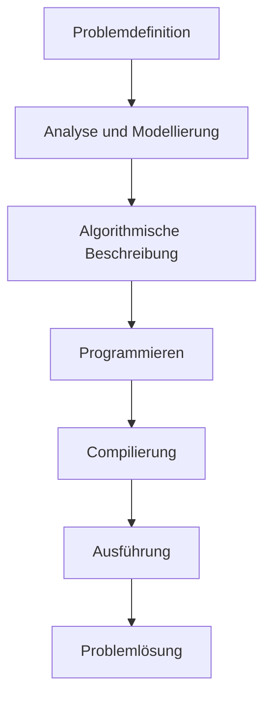
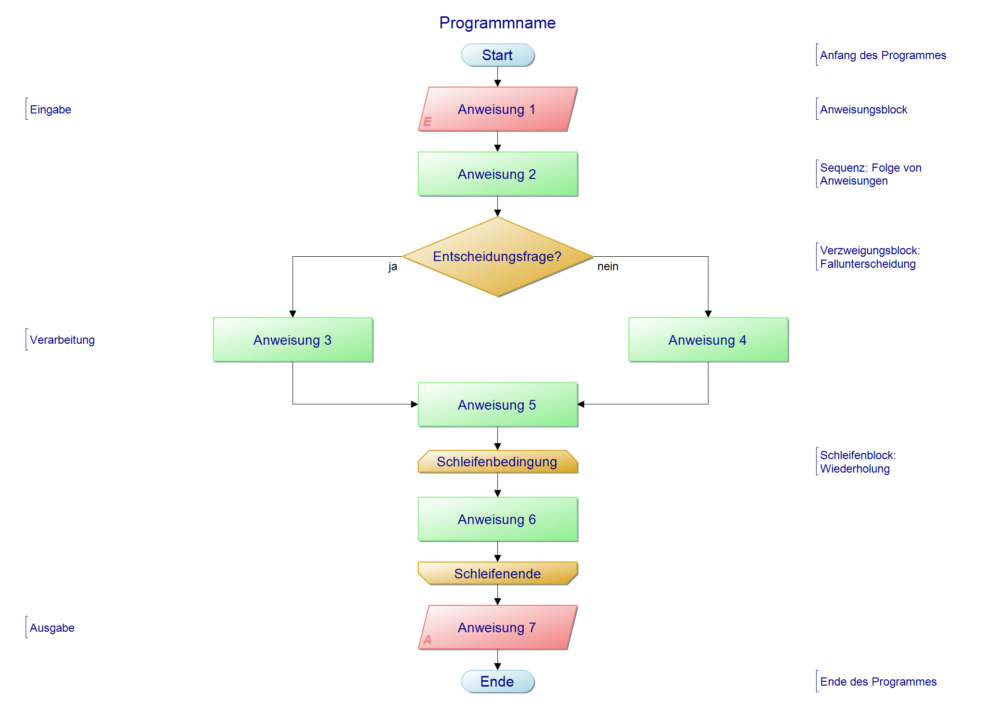
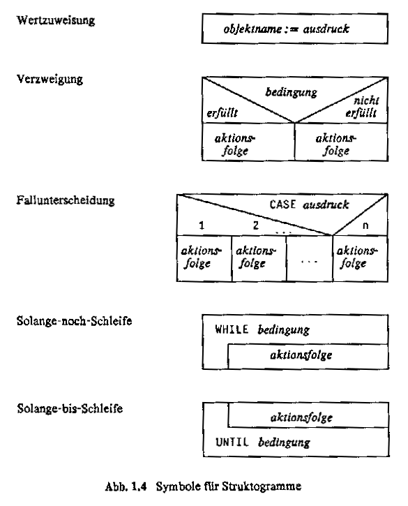

# Phasenmodell und Algorithmen

## Was ist Programmieren?

Programmierung bedeutet, Lösungsschritte für eine Problemstellung so zu formulieren, dass ein Computer sie ausführen kann, um bestimmte Aufgaben zu automatisieren.

Das Schwierige — auch bei KI — ist oft nicht das Codieren, sondern das **präzise Formulieren des Problems**.

## Phasenmodell



1. **Problemdefinition** — Umgangssprachlich: Was ist das Problem, was soll gelöst werden?
2. **Analyse und Modellierung** — Wie lässt sich das Problem strukturieren?
3. **Algorithmische Beschreibung** — Wie lässt sich die Lösung als Schritt-für-Schritt-Anleitung formulieren?
4. **Programmieren** — Wie wird der Algorithmus in einer Programmiersprache umgesetzt?
5. **Compilierung** — Wie wird der Code maschinenlesbar gemacht?
6. **Ausführung** — Das Programm wird ausgeführt.
7. **Problemlösung?** — Wurde das Problem gelöst? Falls nicht, zurück zu einem früheren Schritt.

Ist ein Problem zu groß, wird es aufgeteilt. Das gilt für Probleme genauso wie für Klassen, Methoden und Funktionen.

## Drei Grundstrukturen

Jeder Algorithmus lässt sich aus genau drei Kontrollstrukturen aufbauen:

| Struktur | Bezeichnung | Beschreibung |
|---|---|---|
| Sequenz | Anweisungsfolge | Anweisungen werden der Reihe nach ausgeführt |
| Selektion | Auswahlstruktur | Abhängig von einer Bedingung wird ein Zweig gewählt |
| Iteration | Wiederholungsstruktur | Ein Block wird wiederholt ausgeführt |

**Böhm und Jacopini** haben bewiesen: Jede berechenbare Funktion lässt sich mit diesen drei Strukturen darstellen. `goto` ist nicht notwendig.

## Dijkstra — Go To Statement Considered Harmful

Edsger Dijkstra argumentierte in seinem berühmten Brief (1968), dass unkontrollierte `goto`-Sprungbefehle zu unübersichtlichem, unwartbarem Code führen — **Spaghetti Code**. Die Lösung: strukturierte Kontrollfluss-Elemente (Selektion, Iteration). Ziel ist ein linearer Lesefluss, der leicht nachvollziehbar ist und mathematisch beweisbar korrekt sein kann.

## Notationssprachen

Algorithmen werden vor dem Codieren in einer standardisierten Notation beschrieben. Alle drei sind äquivalent — sie beschreiben denselben Algorithmus, nur in unterschiedlicher Form.

### PAP (Programmablaufplan)

Grafisches Flussdiagramm. Anweisungen, Entscheidungen und Schleifen werden mit standardisierten Symbolen dargestellt und mit Pfeilen verbunden (DIN 66001). Gut lesbar für einfache Abläufe, wird bei tief verschachtelten Strukturen unübersichtlich.



Weiterführend: [PAP (Wikipedia)](https://de.wikipedia.org/wiki/Programmablaufplan)

### Nassi-Shneidermann (Struktogramm)

Grafisch wie der PAP, aber ohne Pfeile. Jede Struktur (Sequenz, Selektion, Iteration) ist ein geschachtelter Block. Das erzwingt strukturierten Code — Spaghetti-Sprünge wie `goto` lassen sich gar nicht darstellen. Norm: **DIN 66261**.



Weiterführend: [Nassi-Shneidermann-Diagramm (Wikipedia)](https://de.wikipedia.org/wiki/Nassi-Shneiderman-Diagramm)

### Pseudocode

Textuelle Beschreibung in einer an Programmiersprachen angelehnten Sprache — kein grafisches Werkzeug, keine strenge Syntax. Pseudocode ist sprachunabhängig und lässt sich schnell schreiben.

Beispiel: Kaffee-Algorithmus als Pseudocode

```
PROGRAMM KaffeeMachen
  WENN Bohnen vorhanden UND Wasser vorhanden UND Behälter nicht voll DANN
    Maschine einschalten
    Tasse unter Auslauf stellen
    Knopf drücken
    WARTEN BIS Kaffee fertig
    Tasse nehmen
  SONST
    Fehlermeldung ausgeben
  ENDE WENN
ENDE PROGRAMM
```

## Beispiel: Kaffee-Algorithmus

**Problem:** Einmal Kaffee mit der Schulmaschine zubereiten.

**Checks (Vorbedingungen):**

- Welcher Automat ist es?
- Sind Kaffeebohnen in der Maschine?
- Ist Wasser in der Maschine?
- Sind Kaffeesatz-Behälter und Auffangbehälter leer genug?

**Ablauf (nur wenn alle Checks positiv):**

```
Kaffeemaschine einschalten
Tasse nehmen
Tasse unter den Auslauf stellen
Knopf drücken
Warten bis Kaffee fertig durchgelaufen
Tasse nehmen und genießen
```
