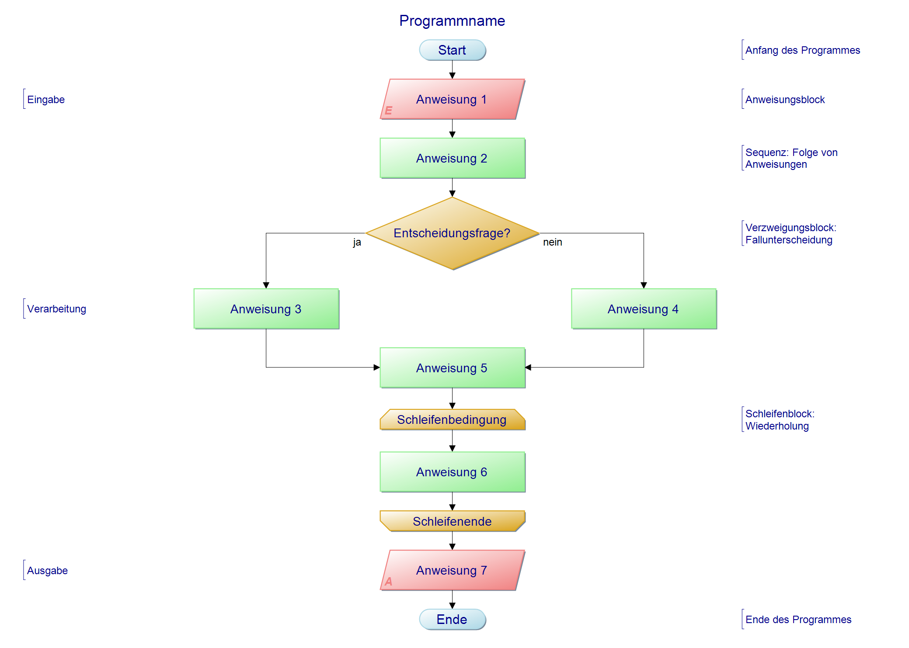
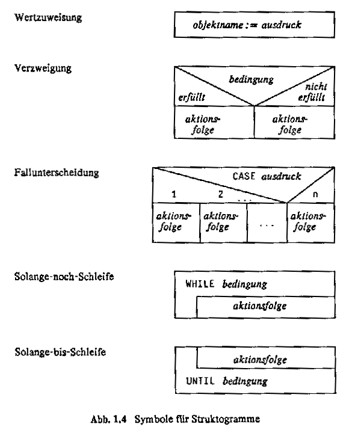

# Phasenmodell und Algorithmen

## Was ist Programmieren?

Programmierung bedeutet, Lösungsschritte für eine Problemstellung so zu formulieren, dass ein Computer sie ausführen kann, um bestimmte Aufgaben zu automatisieren.

Das Schwierige — auch bei KI — ist oft nicht das Codieren, sondern das **präzise Formulieren des Problems**.

## Phasenmodell

```kroki
mermaid

%%{init: {'theme': 'base', 'flowchart': {'htmlLabels': false}, 'themeVariables': {'background': '#231f20', 'mainBkg': '#3b9689', 'primaryColor': '#3b9689', 'primaryTextColor': '#fff', 'primaryBorderColor': '#70c7ba', 'lineColor': '#70c7ba', 'edgeLabelBackground': '#282425', 'nodeTextColor': '#fff', 'clusterBkg': '#282425'}}}%%
flowchart TD
    PD[Problemdefinition]
    AM[Analyse und Modellierung]
    AB[Algorithmische Beschreibung]
    PC[Programmieren]
    CO[Compilierung]
    AU[Ausführung]
    PL[Problemlösung]

    PD --> AM --> AB --> PC --> CO --> AU --> PL
```

1. **Problemdefinition** — Umgangssprachlich: Was ist das Problem, was soll gelöst werden?
2. **Analyse und Modellierung** — Wie lässt sich das Problem strukturieren?
3. **Algorithmische Beschreibung** — Wie lässt sich die Lösung als Schritt-für-Schritt-Anleitung formulieren?
4. **Programmieren** — Wie wird der Algorithmus in einer Programmiersprache umgesetzt?
5. **Compilierung** — Wie wird der Code maschinenlesbar gemacht?
6. **Ausführung** — Das Programm wird ausgeführt.
7. **Problemlösung?** — Wurde das Problem gelöst? Falls nicht, zurück zu einem früheren Schritt.

Ist ein Problem zu groß, wird es aufgeteilt. Das gilt für Probleme genauso wie für Klassen, Methoden und Funktionen.

## Drei Grundstrukturen

Jeder Algorithmus lässt sich aus genau drei Kontrollstrukturen aufbauen:

| Struktur | Bezeichnung | Beschreibung |
|---|---|---|
| Sequenz | Anweisungsfolge | Anweisungen werden der Reihe nach ausgeführt |
| Selektion | Auswahlstruktur | Abhängig von einer Bedingung wird ein Zweig gewählt |
| Iteration | Wiederholungsstruktur | Ein Block wird wiederholt ausgeführt |

**Böhm und Jacopini** haben bewiesen: Jede berechenbare Funktion lässt sich mit diesen drei Strukturen darstellen. `goto` ist nicht notwendig.

## Dijkstra — Go To Statement Considered Harmful

Edsger Dijkstra argumentierte in seinem berühmten Brief (1968), dass unkontrollierte `goto`-Sprungbefehle zu unübersichtlichem, unwartbarem Code führen — **Spaghetti Code**. Die Lösung: strukturierte Kontrollfluss-Elemente (Selektion, Iteration). Ziel ist ein linearer Lesefluss, der leicht nachvollziehbar ist und mathematisch beweisbar korrekt sein kann.

## Notationssprachen

Algorithmen werden vor dem Codieren in einer standardisierten Notation beschrieben. Alle drei sind äquivalent — sie beschreiben denselben Algorithmus, nur in unterschiedlicher Form.

### PAP (Programmablaufplan)

Eines der ältesten grafischen Darstellungsmittel für Algorithmen — entstanden in den 1930er Jahren, in den 1960er Jahren international standardisiert (DIN 66001). Ein PAP ist ein **Flussdiagramm**: Anweisungen, Entscheidungen und Schleifen werden mit genormten Symbolen dargestellt und mit Pfeilen verbunden. Wird zur Visualisierung von Prozessen, Logikabfolgen und einfachen Algorithmen verwendet. Gut lesbar für einfache Abläufe, wird bei tief verschachtelten Strukturen unübersichtlich.



Weiterführend: [PAP (Wikipedia)](https://de.wikipedia.org/wiki/Programmablaufplan)

### Nassi-Shneidermann (Struktogramm)

Entwickelt, um die Prinzipien der **strukturierten Programmierung zu erzwingen**. Im Gegensatz zum PAP gibt es keine Pfeile — das Struktogramm ist **blockorientiert, nicht flussorientiert**. Jede Kontrollstruktur (Sequenz, Selektion, Iteration) ist ein geschachtelter Block. Spaghetti-Sprünge wie `goto` lassen sich gar nicht darstellen — nur die drei erlaubten Kontrollstrukturen sind darstellbar. Norm: **DIN 66261**.



Weiterführend: [Nassi-Shneidermann-Diagramm (Wikipedia)](https://de.wikipedia.org/wiki/Nassi-Shneiderman-Diagramm)

### Pseudocode

Textuelle Beschreibung in einer an Programmiersprachen angelehnten Sprache — kein grafisches Werkzeug, keine strenge Syntax. Pseudocode ist sprachunabhängig und lässt sich schnell schreiben.

Beispiel: Kaffee-Algorithmus als Pseudocode

```
PROGRAMM KaffeeMachen
  WENN Kaffeebohnen >= Mindestmenge UND Wassertank >= Mindestmenge
       UND Trester < Maximalstand UND Auffangschale < Maximalstand DANN
    Kaffeemaschine einschalten
    Tasse unter den Auslauf stellen
    Knopf drücken
    WARTEN BIS Kaffee fertig durchgelaufen
    Tasse nehmen
  SONST
    Fehlermeldung ausgeben
  ENDE WENN
ENDE PROGRAMM
```

### Einsatz heute

In der modernen Softwareentwicklung haben PAP und Struktogramm weitgehend ausgedient. Der PAP ist noch vereinzelt anzutreffen — z. B. für einfache Prozessdiagramme. Das Struktogramm wird kaum noch verwendet, am ehesten noch in der Schule. Abgelöst wurden beide durch **UML** (Unified Modeling Language), das eine breite Palette standardisierter Diagrammtypen für objektorientierte Softwareentwicklung bietet.

## Beispiel: Kaffee-Algorithmus

**Problem:** Einmal Kaffee oder Tee mit der Schulmaschine zubereiten.

### Vorbedingungen

Vor dem Start werden vier Komponenten geprüft. Wassertank und Kaffeefach haben eine **Untergrenze** (Mindeststand) — zu wenig ist ein Problem. Trester und Auffangschale haben eine **Obergrenze** (Maximalstand) — zu voll ist ein Problem:

| Komponente | Prüfung | Grenze |
|---|---|---|
| Wassertank | Mindeststand | Mindestens genug Wasser für eine Tasse |
| Kaffeefach | Mindeststand | Mindestens genug Kaffeebohnen für eine Portion |
| Trester | Maximalstand | Trester nicht voll |
| Auffangschale | Maximalstand | Auffangschale nicht voll |

Das **Kaffeefach** und der **Trester** werden nur bei Kaffee geprüft — bei Tee werden keine Kaffeebohnen benötigt, und Trester entsteht nur bei Kaffee.

### Pseudocode

```
PROGRAMM GetränkZubereiten

  EINGABE Getränkwahl  // "Kaffee" oder "Tee"

  // Wassertank: Mindeststand prüfen (immer)
  WENN Wassertank < Mindeststand für eine Tasse DANN
    AUSGABE "Wassertank auffüllen"
    ABBRECHEN
  ENDE WENN

  // Auffangschale: Maximalstand prüfen (immer)
  WENN Auffangschale >= Maximalstand DANN
    AUSGABE "Auffangschale leeren"
    ABBRECHEN
  ENDE WENN

  // Kaffeespezifische Prüfungen (nur bei Kaffee)
  WENN Getränkwahl = "Kaffee" DANN

    WENN Kaffeefach < Mindeststand für eine Portion Kaffeebohnen DANN
      AUSGABE "Kaffeebohnen nachfüllen"
      ABBRECHEN
    ENDE WENN

    WENN Trester >= Maximalstand DANN
      AUSGABE "Trester leeren"
      ABBRECHEN
    ENDE WENN

  ENDE WENN

  // Ablauf (alle Vorbedingungen erfüllt)
  Kaffeemaschine einschalten
  Tasse unter den Auslauf stellen
  Getränkwahl am Display eingeben
  Knopf drücken
  WARTEN BIS Getränk fertig durchgelaufen
  Tasse nehmen und genießen

ENDE PROGRAMM
```
