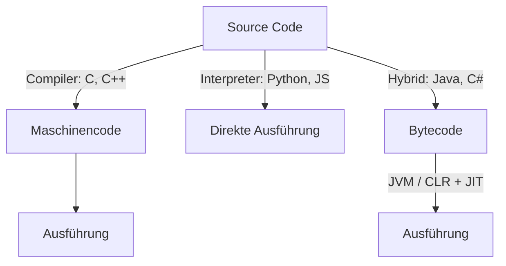
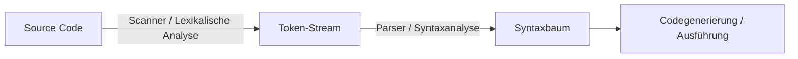

# Programmiersprachen

## Klassifizierungen

Programmiersprachen werden nach drei Kriterien klassifiziert:

- **Maschinennähe:** Wie nah ist die Sprache an der Hardware?
- **Programmierparadigma:** Welches Denkmodell liegt zugrunde? (siehe [Programmierparadigmen](programmierparadigmen.md))
- **Generation:** Historische Einordnung — für den Unterricht nicht relevant.

Alle Programmiersprachen haben eines gemeinsam: Sie werden letztlich in **Maschinensprache** übersetzt.

## Hierarchie der Maschinennähe

```
Maschinensprache  (0010 0101 0011 0100)
      ↓
Assembler  (mov ax, 2)
      ↓
Hochsprachenprogrammierung  (Java, Python, C)
```

**Maschinensprache** ist direkt ausführbarer Binärcode. **Assembler** ist eine mnemonische Darstellung davon — Befehle wie `mov ax, 2` manipulieren Register direkt. Die ALU (Arithmetic Logic Unit) führt die eigentlichen Rechenoperationen durch. Das Übersetzungsprogramm von Assembler-Code zu Maschinencode heißt ebenfalls Assembler.

## Compiler, Interpreter, Hybrid

Jede Hochsprache muss irgendwie zur Maschinensprache gelangen. Es gibt drei Strategien:



| Strategie | Vorgehen | Vertreter | Portabilität |
|---|---|---|---|
| Compiler | Source Code wird vollständig in Maschinencode übersetzt, daraus entsteht eine eigenständige ausführbare Datei | C, C++ | Gering — Code ist plattformspezifisch |
| Interpreter | Source Code wird während der Ausführung Anweisung für Anweisung aus der Quelldatei gelesen, übersetzt und sofort ausgeführt | Python, JavaScript | Hoch — Interpreter muss installiert sein |
| Hybrid | Source Code → Bytecode (Compiler), Bytecode → Ausführung durch VM/JRE (Interpreter) | Java, C# | Hoch — Bytecode läuft auf jeder JVM/CLR |

**Portabilität:** Compilierter Code ist direkt auf die Zielarchitektur zugeschnitten und nicht portabel. Bytecode hingegen läuft überall, wo die passende virtuelle Maschine installiert ist — das ist das Prinzip "Write Once, Run Anywhere" von Java.

## JIT — Just-in-Time-Kompilierung

JIT ist eine Optimierung in Hybrid-Systemen. Die VM erkennt zur Laufzeit, welche Codeteile häufig ausgeführt werden, und kompiliert diese Teile in nativen Maschinencode. Damit kombiniert Hybrid die Portabilität des Interpreters mit der Geschwindigkeit des Compilers.

## Scanner und Parser

Bevor ein Compiler oder Interpreter Source Code verarbeiten kann, muss er ihn verstehen. Das geschieht in zwei Schritten:



- **Scanner (Lexikalische Analyse):** Zerlegt den Text in Tokens — reservierte Wörter (`if`, `while`), Bezeichner, Zahlen, Symbole.
- **Parser (Syntaxanalyse):** Prüft, ob die Token-Folge der Grammatik der Sprache entspricht, und baut daraus einen Syntaxbaum auf.
