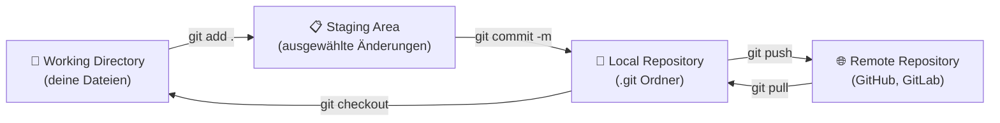

# Git Workflow Modell

## Die Vier Bereiche (Erweiterung)

### 1. Working Directory

Dein lokaler Dateisystem. Das, was du tatsächlich siehst und bearbeitest:

```
project/
├── src/
│   └── Main.java
├── pom.xml
├── .git/              ← Git Datenbank (nicht anfassen!)
└── .gitignore
```

**Status**: `git status` zeigt untracked oder modified Dateien

### 2. Staging Area (Index)

Eine Zwischenschicht, wo du auswählst, welche Änderungen in den nächsten Commit gehören:

```bash
# Datei in Staging hinzufügen
git add src/Main.java

# Alle Dateien in Staging
git add .

# Aus Staging entfernen
git reset src/Main.java
```

**Warum?** Du kannst mehrere Dateien ändern, aber nur einige davon commiten.

Beispiel:
```bash
# Ich ändere zwei Dateien
git add bugfix.java     # Nur diese eine...
git commit -m "Fix bug in X"
# bugfix.java ist committed, andere Änderung bleibt im Working Dir
```

### 3. Local Repository

Dein `.git` Ordner speichert alle Commits, Branches, und Geschichte:

```bash
# Commit erstellen (Staging → Local Repo)
git commit -m "Nachricht"

# Commits anschauen
git log
git log --oneline

# Ein vorheriger Commit anschauen
git show abc123def
```

**Wichtig**: Alles vor diesem Punkt ist 100% lokal und sicher. Nichts geht verloren wenn du crashst.

### 4. Remote Repository

Ein zentraler Server (GitHub, GitLab, etc.), wo das Team zusammenarbeitet:

```bash
# Local → Remote
git push

# Remote → Local
git pull
```

## Visueller Workflow



### Schritt-für-Schritt Erklärung

**Schritt 1: Dateien editieren**
```
Working Directory
├── file.java (MODIFIED)   ← Geändert
└── test.java (UNTRACKED)  ← Neu
```

**Schritt 2: git add**
```
Staging Area
├── file.java              ← Ausgewählt
└── test.java (noch nicht)
```

**Schritt 3: git commit**
```
Local Repository (.git)
[abc123] commit message
├─ file.java               ← Im Local Repo gespeichert
└─ test.java
```

**Schritt 4: git push
┌────────────────────────────┐
│ Remote Repository (GitHub) │
│ [abc123] commit message    │  ← Auf Server
│ ├─ file.java               │
│ └─ test.java               │
└────────────────────────────┘
```

## Szenarios

### Szenario 1: Feature entwickeln

```bash
# Ich arbeite an Datei.java
git add Datei.java

# Mehrere Dateien ändern? Selektiv committen:
git add src/main/Main.java
git commit -m "Implement main logic"

git add src/test/MainTest.java
git commit -m "Add tests for main logic"

# Alle zum Server pushen
git push
```

### Szenario 2: Fehler beheben

```bash
# Ich merke: letzte Änderung war falsch!
git reset --soft HEAD~1
# (Commit ist weg, Dateien sind aber noch im Staging)

git add datei1.java
git commit -m "Corrected version"

git push
```

### Szenario 3: Mit anderen zusammenarbeiten

```bash
# Morgens: Anderen ihre Änderungen holen
git pull

# Tagsüber: Eigene Änderungen commiten
git add .
git commit -m "My changes"

# Abends: Push zu Server
git push
```

## Merge (Zusammenführen)

Wenn zwei Leute verschiedene Dinge ändern:

```bash
# Person A ändertet Datei X, pusht
# Person B ändert Datei Y, will pushen → Konflikt!

# Person B muss zuerst pullen:
git pull  # ← Automatischer Merge oder Konflikt

# Falls Konflikt:
# 1. Datei öffnen, Konflikt lösen
# 2. git add gelöste_datei.java
# 3. git commit -m "Merged main"
# 4. git push
```

## Branch Workflow (später)

Für größere Features arbeitet man normalerweise auf separaten Branches:

```bash
git checkout -b feature/neue-funktion

# Hier arbeiten, commiten
git add .
git commit -m "..."

# Dann mergen zu main
git checkout main
git pull
git merge feature/neue-funktion
git push
```

Siehe [Befehle](Befehle.md) für detaillierte Branch-Befehle.

## Zusammenfassung

| Bereich | Befehl | Bedeutung |
|---------|--------|-----------|
| Working Dir → Staging | `git add` | Änderungen auswählen |
| Staging → Local Repo | `git commit` | Snapshot erstellen |
| Local Repo → Remote | `git push` | Mit Team teilen |
| Remote → Local Repo | `git pull` | Team-Updates holen |
| Local Repo anschauen | `git log` | History |
| Working Dir Status | `git status` | Was hat sich geändert? |
