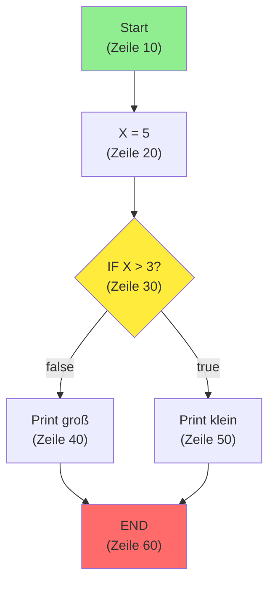
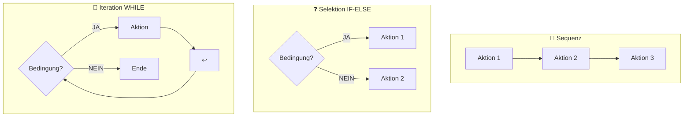

# Böhm-Jacopini Theorem

## Das Theorem

> Jedes Programm kann mit nur drei Kontrollstrukturen geschrieben werden:
> 1. **Sequenz** (nacheinander)
> 2. **Selektion** (if-else)
> 3. **Iteration** (while/for)
>
> **GO TO ist nicht notwendig!**

**Autoren**: Corrado Böhm und Giuseppe Jacopini (1966)

## Historischer Kontext

### Vorher: GO TO Statement

In den 1950er/60ern hatten alle Sprachen `GOTO`:

```
10: PRINT "Start"
20: X = 5
30: IF X > 3 THEN GOTO 50
40: PRINT "X ist klein"
50: PRINT "X ist groß"
60: END
```

**Problem**: "Spaghetti Code" — Programm Fluss ist unvorstellbar verwirrend!



### Edsger Dijkstra: "GO TO Statement Considered Harmful"

1968 schrieb Dijkstra einen berühmten Essay:

> "For a number of years I have been familiar with the observation that the quality of programmers is a decreasing function of the density of go to statements in the programs they produce."

**Übersetzung**: Je mehr GOTO, desto schlechter der Code.

## Die Lösung: Strukturiertes Programmieren

Mit nur 3 Kontrollstrukturen:



## Beweis (Vereinfacht)

Böhm und Jacopini zeigten: Man kann **jeden** Algorithmus (jedes Programm) umschreiben ohne GOTO zu nutzen.

### Beispiel: GOTO zu Strukturiert

**Vorher (mit GOTO)**:
```
10: X = 0
20: IF X == 10 THEN GOTO 50
30: PRINT X
40: X = X + 1; GOTO 20
50: PRINT "Fertig"
```

**Nachher (strukturiert)**:
```
X = 0
WHILE X != 10
  PRINT X
  X = X + 1
PRINT "Fertig"
```

**Gleiche Logik, kein GOTO nötig!**

## Warum ist das wichtig?

### Ohne GO TO

```
Code liest von oben nach unten

int x = 5;        // Schritt 1
if (x > 3) {      // Schritt 2
  print("groß");  // Schritt 3
}
print("Ende");    // Schritt 4
```

**Linear**, leicht zu verstehen.

### Mit GO TO

```
10: x = 5
20: IF x > 3 THEN GOTO 50
30: PRINT "klein"
40: GOTO 70
50: PRINT "groß"
60: (Fehler: Zeile 60 existiert nicht!)
70: PRINT "Ende"
```

**Sprünge überall**, Kontrollfluss ist kaos!

## Turing Vollständigkeit

**Wichtig**: GO TO macht Sprache nicht mächtiger!

- Sprache mit {Sequenz, If, While} = Turing-vollständig
- Sprache mit GO TO = auch Turing-vollständig

**GO TO ist also überflüssig!**

Man kann mit Go TO schneller programmieren, aber mit strukturierten Kontrolstrukturen **verständlicher** und **wartbarer**.

## Moderne Implikationen

### Moderne Sprachen

```java
// Kein GOTO in Java (außer als reserved word!)
// Nur strukturierte Kontrolstrukturen
```

### Best Practice

**Regel**: Verwende nur Sequenz, Selektion, Iteration!

```java
// ✓ Gut (strukturiert)
if (x > 5) {
  doSomething();
} else {
  doOtherThing();
}

// ✗ Schlecht (Pseudo-GOTO mit label)
// (Sollte man nicht nutzen, selbst wenn möglich)
label: for (...) {
  if (error) break label;  // ← Ähnlich wie GOTO
}
```

### Immer strukturiert denken

Wenn dein Code:
- Viele verschachtelte If-Else hat → Refactor!
- Viele Schleifen-Breaks/Continues → Simplify!
- Schwer zu verstehen ist → Funktionen extrahieren!

```java
// ✗ Kompliziert (viele breaks/continues)
for (int i = 0; i < 10; i++) {
  if (i == 2) continue;
  if (i == 7) break;
  if (i % 2 == 0) {
    System.out.println(i);
  }
}

// ✓ Klar (Logik in Funktion)
for (int i = 0; i < 10; i++) {
  if (shouldPrint(i)) {
    System.out.println(i);
  }
}

boolean shouldPrint(int i) {
  if (i == 2 || i == 7 || i % 2 != 0) return false;
  return true;
}
```

## Zusammenfassung

```
Böhm-Jacopini Theorem (1966):
├─ Sequenz, Selektion, Iteration genügen
├─ GO TO ist überflüssig
└─ Strukturierter Code ist wartbarer

Edsger Dijkstra:
└─ "GO TO Statement Considered Harmful"

Moderne Best Practice:
├─ Nur strukturierte Kontrolstrukturen
├─ Keine GOTO-ähnlichen Sprünge
└─ Code sollte linear zu verstehen sein
```

**Morale**: Schreibe Code den jemand anders (oder du in 6 Monaten) verstehen kann!

Siehe auch: [Kontrollstrukturen Überblick](Sequenz.md)
