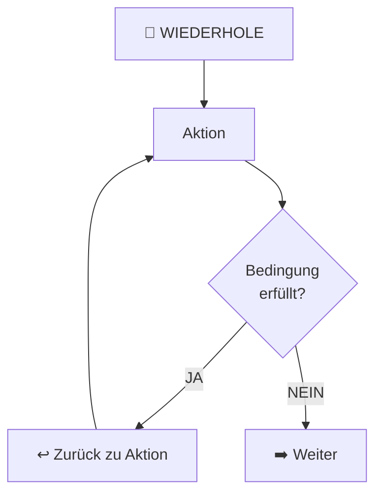

# Iteration (Wiederholungsstrukturen)

## Definition

**Iteration** (Schleife) bedeutet: Wiederhole einen Code-Block solange eine Bedingung erfüllt ist.



## While-Schleife (Kopfgesteuert)

### Syntax

```java
while (bedingung) {
  // Code wird wiederholt solange bedingung true ist
}
```

### Charakteristiken

- Bedingung wird **vor** Ausführung überprüft
- Kann 0x ausgeführt werden (wenn Bedingung von Anfang false)
- "Kopfgesteuert" (Kopf = Bedingung oben)

### Beispiel

```java
int i = 0;
while (i < 5) {
  System.out.println(i);
  i++;
}
```

Output:
```
0
1
2
3
4
```

**Schritt-für-Schritt**:
1. `i = 0`, Check `0 < 5`? JA → Print, i++
2. `i = 1`, Check `1 < 5`? JA → Print, i++
3. `i = 2`, Check `2 < 5`? JA → Print, i++
4. `i = 3`, Check `3 < 5`? JA → Print, i++
5. `i = 4`, Check `4 < 5`? JA → Print, i++
6. `i = 5`, Check `5 < 5`? NEIN → Schleife endet

### Vorsicht: Infinite Loop

```java
while (true) {
  System.out.println("Endlosschleife!");
  // Keine Bedingung um zu stoppen → läuft ewig!
}
```

Immer Bedingung für Abbruch!

## Do-While-Schleife (Fußgesteuert)

### Syntax

```java
do {
  // Code
} while (bedingung);
```

### Charakteristiken

- Bedingung wird **nach** Ausführung überprüft
- Wird **mindestens 1x** ausgeführt
- "Fußgesteuert" (Fuß = Bedingung unten)

### Beispiel

```java
int i = 0;
do {
  System.out.println(i);
  i++;
} while (i < 5);
```

Output: Gleich wie while-Beispiel (0 1 2 3 4)

### Unterschied zu While

```java
int i = 10;

// While
while (i < 5) {
  System.out.println(i);  // ← Wird nicht ausgeführt!
}

// Do-While
do {
  System.out.println(i);  // ← Wird 1x ausgeführt!
} while (i < 5);
```

**Do-While wird **immer** mindestens einmal ausgeführt!**

## For-Schleife (Zählschleife)

### Syntax

```java
for (int i = 0; i < 5; i++) {
  // i läuft von 0 bis 4
}
```

Bestandteile:
- `int i = 0` — Initialization
- `i < 5` — Bedingung
- `i++` — Increment (nach jedem Durchlauf)

### Beispiel

```java
for (int i = 1; i <= 3; i++) {
  System.out.println("Tag " + i);
}
```

Output:
```
Tag 1
Tag 2
Tag 3
```

### For vs While

```java
// For
for (int i = 0; i < 5; i++) {
  System.out.println(i);
}

// Äquivalent mit While
int i = 0;
while (i < 5) {
  System.out.println(i);
  i++;
}
```

**For ist Shorthand für While mit bekannter Anzahl!**

## Enhanced For-Schleife (For-Each)

### Syntax

```java
for (String item : liste) {
  // Iteriere über jeden item in liste
}
```

### Beispiel

```java
List<String> namen = Arrays.asList("Alice", "Bob", "Clara");

for (String name : namen) {
  System.out.println("Hallo " + name);
}
```

Output:
```
Hallo Alice
Hallo Bob
Hallo Clara
```

**Vorteil**: Kein Index-Management nötig!

```java
// ✗ Klassisch (fehleranfällig)
for (int i = 0; i < namen.size(); i++) {
  String name = namen.get(i);
  System.out.println("Hallo " + name);
}

// ✓ Modern (sauberer)
for (String name : namen) {
  System.out.println("Hallo " + name);
}
```

## Break und Continue

### Break (Schleife stoppen)

```java
for (int i = 0; i < 10; i++) {
  if (i == 5) break;  // ← Stoppe hier
  System.out.println(i);
}
```

Output: 0 1 2 3 4 (stoppt bei 5)

### Continue (Iteration überspringen)

```java
for (int i = 0; i < 5; i++) {
  if (i == 2) continue;  // ← Überspringe Iteration
  System.out.println(i);
}
```

Output: 0 1 3 4 (2 wird übersprungen)

## Nested Loops (Verschachtelte Schleifen)

```java
for (int i = 1; i <= 3; i++) {
  for (int j = 1; j <= 3; j++) {
    System.out.println(i + " * " + j + " = " + (i * j));
  }
}
```

Output (Multiplikationstabelle):
```
1 * 1 = 1
1 * 2 = 2
1 * 3 = 3
2 * 1 = 2
2 * 2 = 4
...
```

**Vorsicht**: Nested Loops sind langsam!
- 2 Schleifen: n² Operationen
- 3 Schleifen: n³ Operationen

## Wahl der Schleife

| Situation | Nutze |
|-----------|-------|
| Bekannte Anzahl | `for` |
| Über Collection | `for-each` |
| Bedingung unbekannt | `while` |
| Mindestens 1x | `do-while` |
| Index wichtig | `for` (klassisch) |

## Zusammenfassung

- **While**: Solange Bedingung wahr
- **Do-While**: Mindestens 1x, dann Bedingung
- **For**: Zählschleife (bekannte Anzahl)
- **For-Each**: Über Collections
- **Break**: Stoppe Schleife
- **Continue**: Überspringe Iteration

Siehe auch: [Kontrollstrukturen Überblick](Sequenz.md), [Selektion](Selektion.md)
