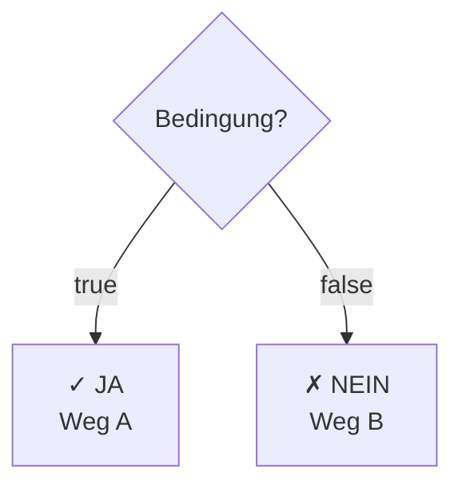

# Selektion (Auswahlstrukturen)

## Definition

**Selektion** bedeutet: Wähle einen von mehreren Wegen basierend auf einer Bedingung.



## Einfache Selektion: If-Else

### Syntax

```java
if (bedingung) {
  // Code wenn bedingung == true
} else {
  // Code wenn bedingung == false
}
```

### Beispiel

```java
int alter = 18;

if (alter >= 18) {
  System.out.println("Du darfst wählen");
} else {
  System.out.println("Du darfst nicht wählen");
}
```

### Nur If (ohne Else)

```java
if (fehler) {
  System.out.println("Error!");
  // Wenn kein else: einfach weitermachen
}
```

## Mehrfache Selektion: If-Else-If

### Syntax

```java
if (bedingung1) {
  // Weg 1
} else if (bedingung2) {
  // Weg 2
} else if (bedingung3) {
  // Weg 3
} else {
  // Default Weg
}
```

### Beispiel: Noten-Klassifikation

```java
int note = 85;

if (note >= 90) {
  System.out.println("A - Sehr gut");
} else if (note >= 80) {
  System.out.println("B - Gut");
} else if (note >= 70) {
  System.out.println("C - Befriedigend");
} else if (note >= 60) {
  System.out.println("D - Genügend");
} else {
  System.out.println("F - Nicht bestanden");
}
```

Output: "B - Gut"

**Wichtig**: Erste zutreffende Bedingung wird ausgeführt!

```
note = 85
├─ note >= 90? NEIN → überspring
├─ note >= 80? JA → hier ausführen!
└─ (Rest wird ignoriert)
```

## Switch-Case

### Wann nutzen?

Switch ist besser wenn:
- Du eine Variable gegen mehrere **spezifische Werte** checkst
- Nicht gegen Ranges

### Syntax

```java
switch (variable) {
  case wert1:
    // Code wenn variable == wert1
    break;  // Wichtig!

  case wert2:
    // Code wenn variable == wert2
    break;

  default:
    // Code wenn keine case zutrifft
    break;  // Optional bei default
}
```

### Beispiel

```java
String tag = "Montag";

switch (tag) {
  case "Montag":
    System.out.println("Arbeitstag");
    break;

  case "Dienstag":
  case "Mittwoch":
  case "Donnerstag":
    System.out.println("Arbeitstag");
    break;

  case "Freitag":
    System.out.println("Fast Wochenende!");
    break;

  case "Samstag":
  case "Sonntag":
    System.out.println("Wochenende!");
    break;

  default:
    System.out.println("Unbekannter Tag");
}
```

Output: "Arbeitstag"

### Fall-Through (ohne break)

```java
case "Dienstag":
case "Mittwoch":
case "Donnerstag":
  // Alle drei Fälle führen denselben Code aus
```

**WICHTIG**: `break` verhindert Fall-Through!

```java
switch (x) {
  case 1:
    System.out.println("Ein");
    // Kein break! → Fall-Through!
  case 2:
    System.out.println("Zwei");
    break;
  case 3:
    System.out.println("Drei");
    break;
}

// Wenn x = 1:
// Output: "Ein" + "Zwei" (nicht gewünscht!)
```

## If-Else vs Switch

| Aspekt | If-Else | Switch |
|--------|---------|--------|
| **Ranges** | ✓ Gut | ✗ Schwierig |
| **Spezifische Werte** | ✓ Ok | ✓✓ Besser |
| **Bedingungen** | ✓✓ Flexibel | ✗ Nur == |
| **Lesbarkeit** | ~ | ✓ (für viele cases) |

**Use Switch für**:
```java
switch (day) { ... }        // ✓
switch (value) { ... }      // ✓
switch (statusCode) { ... } // ✓
```

**Use If-Else für**:
```java
if (x > 5 && y < 10) { ... }        // ✓
if (alter >= 18) { ... }           // ✓
if (name.contains("x")) { ... }     // ✓
```

## Logische Operatoren

Bedingungen können kombiniert werden:

### && (UND)

```java
if (alter >= 18 && führerschein == true) {
  System.out.println("Darf Auto fahren");
}
```

Beide Bedingungen müssen true sein.

### || (ODER)

```java
if (istWochenende || istFeiertag) {
  System.out.println("Kein Schule");
}
```

Mindestens eine Bedingung muss true sein.

### ! (NICHT)

```java
if (!hatCovid) {
  System.out.println("Darf zur Schule");
}
```

Negiert die Bedingung.

### Komplexe Bedingungen

```java
if ((alter >= 18 || elternErlaubnis) && führerschein) {
  System.out.println("Darf fahren");
}
```

(Klammern für Lesbarkeit!)

## Ternärer Operator

Kurze If-Else in einer Zeile:

```java
// Normal
String ergebnis;
if (note >= 50) {
  ergebnis = "Bestanden";
} else {
  ergebnis = "Nicht bestanden";
}

// Ternär (Shorthand)
String ergebnis = note >= 50 ? "Bestanden" : "Nicht bestanden";
```

Syntax: `bedingung ? wennTrue : wennFalse`

**Nutzen sparsam!** Nicht für komplexe Logik.

## Best Practices

1. **Klare Bedingungen**: Variable aussagekräftig nennen
   ```java
   if (age >= 18) { }  // ✓ Klar
   if (a >= 18) { }    // ✗ Was ist a?
   ```

2. **Guard Clauses**: Negationen früh raus
   ```java
   // Besser
   if (!isValid) return;
   // ... Restlicher Code (happy path)
   ```

3. **Nicht zu verschachtelt**:
   ```java
   // ✗ Schlecht
   if (a) {
     if (b) {
       if (c) {
         ...
       }
     }
   }

   // ✓ Besser
   if (!a) return;
   if (!b) return;
   if (!c) return;
   // ... Code hier
   ```

Siehe auch: [Kontrollstrukturen Überblick](Sequenz.md), [Iteration](Iteration.md)
