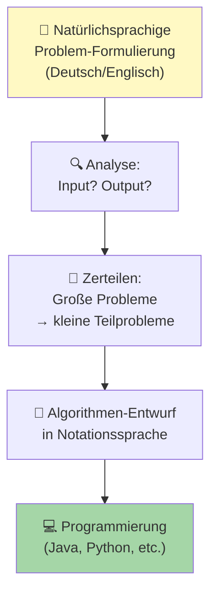

# Algorithmen

## Definition

Ein **Algorithmus** ist eine präzise, schrittweise Anweisung zur Lösung eines Problems:

- Endlich (hat ein Ende)
- Deterministisch (gleicher Input = gleicher Output)
- Berechenbar (ein Computer kann es ausführen)

**Beispiel**: Rezept zum Kuchenbacken ist ein Algorithmus (Schritt 1 → 2 → 3 → Fertig)

## Von Problem zu Algorithmus



## Notationssprachen (Darstellung)

Es gibt standardisierte Wege, Algorithmen zu beschreiben:

### 1. PAP (Programmablaufplan)

Visuell mit Symbolen nach DIN 66001:

```
    ┌─────────┐
    │  START  │
    └────┬────┘
         │
    ┌────▼────────┐
    │ Eingabe: n  │
    └────┬────────┘
         │
    ┌────▼─────────────┐
    │ sum = 0, i = 1   │
    └────┬─────────────┘
         │
    ┌────▼──────────────┐
    │ i <= n ?          │  ◄─── Entscheidung (Raute)
    └────┬──────────────┘
       JA│ NEIN
        │  │
   ┌────▼─────┐       ┌──────────────┐
   │ sum += i  │       │ Ausgabe sum  │
   │ i += 1    │       └──────┬───────┘
   └────┬─────┘              │
        │◄─────────────┐     │
        │              │     │
        └──────────┬───┘     │
                   │         │
                   └────┬────┘
                        │
                    ┌───▼──┐
                    │ END  │
                    └──────┘
```

### 2. Struktogramm (Nassi-Shneidermann)

Rechteck-basiert, strukturiert:

```
┌────────────────────────────┐
│ sum ← 0, i ← 1             │
├────────────────────────────┤
│          i ≤ n ?           │
│       /         \          │
│     JA          NEIN       │
│    ┌─┐         ┌──┐        │
│    │+│ sum+=i  │  │        │
│    │ │ i+=1    │  │        │
│    └─┘         └──┘        │
├────────────────────────────┤
│ Ausgabe: sum               │
└────────────────────────────┘
```

### 3. Pseudocode

Text-basiert, quasi-Code:

```
ALGORITHMUS Summe(n)
  sum ← 0
  FÜR i ← 1 BIS n
    sum ← sum + i
  GEBE sum ZURÜCK
ENDE ALGORITHMUS
```

## Eigenschaften guter Algorithmen

### Korrektheit

Löst das Problem wirklich?

```
Input: n = 5
Output: 1+2+3+4+5 = 15 ✓
```

### Effizienz

Wie schnell? Wie viel Memory?

```
Langsam:  n² Operationen
Schnell:  n log(n) Operationen
```

### Verständlichkeit

Können andere den Code verstehen?

```
Gut:  sum += value;
Schlecht: s+=v;s+=v;s+=v; (redundant)
```

## Beispiele

### 1. Suche (Linear Search)

**Problem**: Finde ein Element in einer Liste

**Pseudocode**:
```
FUNKTION linearSearch(list, target)
  FÜR JEDEN element IN list
    WENN element == target
      GEBE Index ZURÜCK
  GEBE -1 ZURÜCK  (nicht gefunden)
ENDE
```

**Komplexität**: O(n)

### 2. Sortierung (Bubble Sort)

**Problem**: Liste aufsteigend sortieren

**Pseudocode**:
```
FUNKTION bubbleSort(list)
  n ← length(list)
  FÜR i ← 0 BIS n-1
    FÜR j ← 0 BIS n-1-i
      WENN list[j] > list[j+1]
        SWAP(list[j], list[j+1])
ENDE
```

**Komplexität**: O(n²)

### 3. Binäre Suche

**Problem**: Schnell ein Element in SORTIERTER Liste finden

**Pseudocode**:
```
FUNKTION binarySearch(sortedList, target)
  left ← 0
  right ← length(sortedList) - 1

  WÄHREND left <= right
    mid ← (left + right) / 2
    WENN sortedList[mid] == target
      GEBE mid ZURÜCK
    WENN sortedList[mid] < target
      left ← mid + 1
    SONST
      right ← mid - 1

  GEBE -1 ZURÜCK  (nicht gefunden)
ENDE
```

**Komplexität**: O(log n)

## Algoritmen-Analyse (Big-O)

Wie schnell wird's bei großen Datenmengen?

```
O(1)        Konstant      (sehr schnell)
O(log n)    Logarithmisch
O(n)        Linear        (proportional)
O(n²)       Quadratisch   (langsam)
O(2ⁿ)       Exponentiell  (sehr langsam)
O(n!)       Faktoriell    (unmöglich ab n≈10)
```

Visualisierung:
```
      Zeit
       ↑
       │           O(n!)
       │          /
       │        O(2ⁿ)
       │       /
       │     O(n²)
       │    /
       │  O(n)
       │ /
       │O(log n)
       │O(1)
       └──────────────────→ Datengröße (n)
```

**Wichtig**: Bei n=1000:
- O(n) = 1000 Operationen
- O(n²) = 1,000,000 Operationen
- O(n!) = unmöglich

## Debugging von Algorithmen

1. **Trace**: Schreib die Ausführung Schritt-für-Schritt auf
2. **Breakpoints**: Pausiere an kritischen Stellen
3. **Unit Tests**: Teste mit verschiedenen Inputs
4. **Edge Cases**: Test mit Extrem-Fällen (0, negative, sehr große Werte)

## Zusammenfassung

- **Algorithmen sind Schritt-für-Schritt Lösungen**
- **Notationssprachen**: PAP, Struktogramm, Pseudocode
- **Analyse**: Korrektheit, Effizienz, Verständlichkeit
- **Big-O Komplexität**: Wie skaliert der Algorithmus?

Siehe auch: [Kontrollstrukturen](../Kontrollstrukturen/Sequenz.md), [Notationssprachen](Notationssprachen.md), [Datenstrukturen](Datenstrukturen.md)
