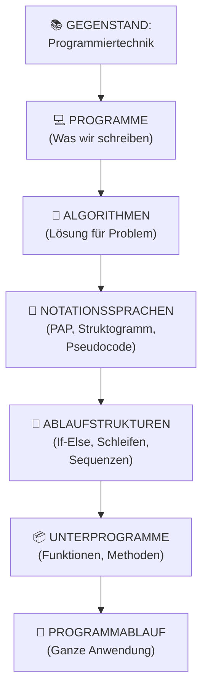
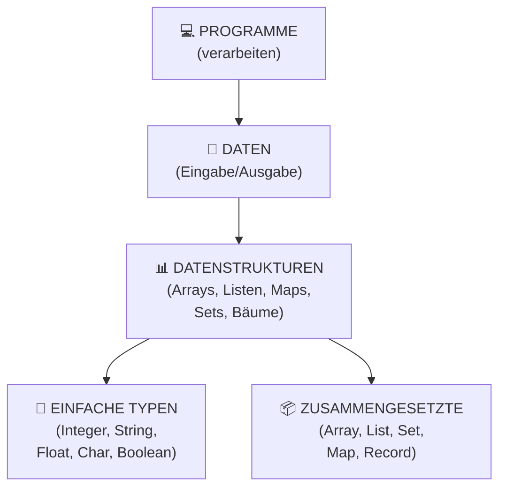

# Programmierung: Concept Map

## Übergeordnete Struktur



Parallel dazu:



## Die zwei großen Blöcke

### Block 1: Algorithmen & Kontrollstrukturen

**Frage**: Wie läuft das Programm ab? Welche Logik braucht es?

- Sequenz (nacheinander)
- Selektion (if-else, switch)
- Iteration (for, while, do-while)

Diese drei Grundstrukturen genügen, um jeden Algorithmus zu implementieren!

### Block 2: Datenstrukturen

**Frage**: Welche Form haben die Daten? Wie speichere ich sie sinnvoll?

- Array: Fester Index, schnelle Zugriffe
- List: Dynamische Größe, langsamer als Array
- Map: Key-Value Paare (Wörterbuch)
- Set: Nur Unikate, schnelle Membership-Checks
- Stack: LIFO (Last In First Out)
- Queue: FIFO (First In First Out)
- Tree: Hierarchische Strukturen

## Notationssprachen

Algorithmen modelliert man VOR der Programmierung in standardisierten Sprachen:

### PAP (Programmablaufplan)

Visuell mit Symbolen:
```
[Start] → [Entscheidung] → [Aktion] → [End]
             ↙      ↘
          JA        NEIN
```

### Nassi-Shneidermann (Struktogramm)

Rechteck-basiert, strukturiert:
```
┌─────────────────────┐
│ Aktion 1            │
├─────────────────────┤
│ ┌─────────┬─────────┤
│ │  WENN   │ SONST   │
│ ├─────────┼─────────┤
│ │ Aktion2 │ Aktion3 │
│ └─────────┴─────────┘
└─────────────────────┘
```

### Pseudocode

Text, quasi-Code, aber verständlich:
```
FUNKTION berechneSum (array)
  sum = 0
  FÜR JEDEN Wert IN array
    sum = sum + Wert
  GEBE sum ZURÜCK
ENDE
```

**Die Notationssprache ist egal, solange sie klar ist!**

## Ablaufstrukturen im Detail

### 1. Sequenz (Anweisungsfolge)

Nacheinander, keine Entscheidung:
```
Schritt 1 → Schritt 2 → Schritt 3 → Ende
```

Beispiel: Tasse Kaffee machen:
1. Kaffeebohnen in Maschine
2. Wasser einfüllen
3. Button drücken
4. Warten
5. Kaffee trinken

### 2. Selektion (Auswahlstruktur)

Abhängig von Bedingung:

**Einfach** (If-Else):
```
WENN Bedingung DANN Aktion1 SONST Aktion2
```

**Mehrfach** (Switch):
```
SWITCH Wert
  CASE 1: Aktion1
  CASE 2: Aktion2
  CASE 3: Aktion3
  SONST: AktionDefault
```

### 3. Iteration (Wiederholungsstruktur)

Solange bis Bedingung erfüllt:

**Kopfgesteuert** (While):
```
WÄHREND Bedingung
  Aktion
```
→ Bedingung wird vor Iteration überprüft (kann 0x ausgeführt werden)

**Fußgesteuert** (Do-While):
```
WIEDERHOLE
  Aktion
BISZU Bedingung
```
→ Wird mindestens 1x ausgeführt

**Zählschleife** (For):
```
FÜR i = 0 BIS n
  Aktion mit i
```

## Böhm-Jacopini Theorem

**Wichtigster Satz der Programmierung:**

> Jedes berechenbare Problem kann mit nur drei Kontrollstrukturen gelöst werden:
> 1. Sequenz
> 2. Selektion
> 3. Iteration

**Konsequenz**: GO TO ist überflüssig und führt zu "Spaghetti Code"!

## Datenstrukturen: Real-Life Analogien

### Stack (Stapel)

```
[Buch 3] ← Oben (pop)
[Buch 2]
[Buch 1] ← Unten (push)
```

LIFO: Zuletzt oben liegendes Buch nehmen

Beispiel: Browser-History (Back-Button)

### Queue (Warteschlange)

```
[Person 1] → [Person 2] → [Person 3]
Hinten (enqueue)                    Vorne (dequeue)
```

FIFO: Erste Person wird bedient

Beispiel: Print-Queue

### Hash / Map

```
"Alice" → 123
"Bob"   → 456
"Clara" → 789
```

Key → Value Zuordnung

Beispiel: Wörterbuch (Wort → Definition)

### Tree (Baum)

```
         CEO
        /   \
      VP1   VP2
      / \    / \
    E1 E2  E3 E4
```

Hierarchie mit Parent-Child Beziehungen

Beispiel: Organisationsstruktur

## WANN nutze ich WELCHE Datenstruktur?

| Problem | Struktur | Warum |
|---------|----------|-------|
| Schneller Zugriff auf Index | Array | O(1) Zugriff |
| Dynamisch größer werden | List | Kann wachsen |
| Key-Value Abfragen | Map | Schnelle Lookups |
| Keine Duplikate | Set | Automatisch dedupliziert |
| LIFO Zugriff | Stack | Last-In-First-Out |
| FIFO Zugriff | Queue | First-In-First-Out |
| Hierarchie | Tree | Parent-Child |

**Das ist eine kritische Fähigkeit!**

## Zusammenfassung

```
PROGRAMMIEREN
    ↓
    ├─ ALGORITHMEN (Wie läuft es ab?)
    │  ├─ Modelliert mit Notationssprachen
    │  ├─ Aus drei Grundstrukturen:
    │  │  ├─ Sequenz
    │  │  ├─ Selektion
    │  │  └─ Iteration
    │  └─ In Unterprogrammen organisiert
    │
    └─ DATENSTRUKTUREN (Welche Daten? In welcher Form?)
       ├─ Einfache Typen (Int, String, etc.)
       ├─ Zusammengesetzte Typen (Array, List, etc.)
       └─ Wahl abhängig vom Problem
```

Siehe auch: [Algorithmen](Algorithmen.md), [Datenstrukturen](Datenstrukturen.md), [Notationssprachen](Notationssprachen.md)
