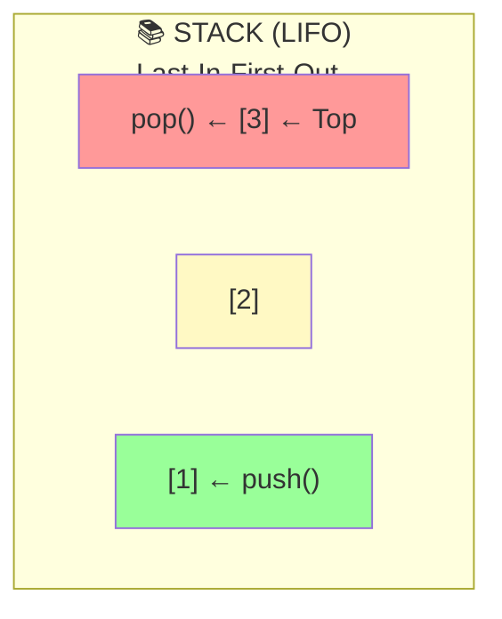
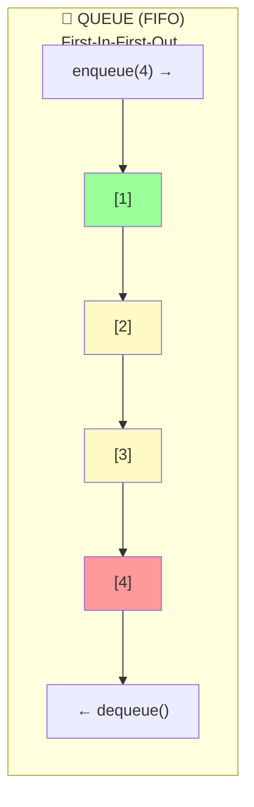

# Datenstrukturen

## Was ist eine Datenstruktur?

Eine **Datenstruktur** ist eine Möglichkeit, Daten zu organisieren und zu speichern:

- Bestimmt wie Daten angeordnet werden
- Beeinflusst Zugriffsgeschwindigkeit
- Entscheidend für Algorithmus-Effizienz

**Analoge**: Ein Adressbuch ist auch eine Datenstruktur (alphabetisch sortiert für schnelles Finden)

## Einfache Datentypen

**Primitive Typen**, einzelne Werte:

| Typ | Größe | Beispiel |
|-----|-------|---------|
| `int` | 32 bit | 42 |
| `long` | 64 bit | 9223372036854775807 |
| `float` | 32 bit | 3.14 |
| `double` | 64 bit | 2.718281828 |
| `char` | 16 bit | 'A' |
| `boolean` | 1 bit | true/false |
| `String` | variabel | "Hallo" |

## Zusammengesetzte Datenstrukturen

Multiple zusammenhängende Werte:

### 1. Array (Feld)

**Fester Index-basiert Zugriff**:

```
Index:  0    1    2    3    4
      ┌────┬────┬────┬────┬────┐
Array │ 10 │ 20 │ 30 │ 40 │ 50 │
      └────┴────┴────┴────┴────┘
```

**Vorteile**:
- Schnell: O(1) Zugriff
- Einfach
- Memory-effizient

**Nachteile**:
- Feste Größe (in Java)
- Schwierig zu einfügen/löschen

### 2. List (Dynamisches Array)

**Variable Größe, Index-basiert**:

```
Initial: [10, 20, 30]
.add(40) → [10, 20, 30, 40]
.remove(1) → [10, 30, 40]
.add(0, 5) → [5, 10, 30, 40]
```

**Vorteile**:
- Dynamisch größbar
- Einfach zu bearbeiten

**Nachteile**:
- Langsamer als Array
- O(n) beim einfügen/löschen

### 3. Map / Dictionary

**Key-Value Paare** (wie Wörterbuch):

```
     Key  → Value
    "Alice" → 23
    "Bob"   → 31
    "Clara" → 27
```

**Pseudocode**:
```
map["Alice"] = 23
map["Bob"] = 31

GET map["Alice"]  → 23
GET map["Charlie"] → null (nicht vorhanden)
```

**Vorteile**:
- Schnelle Lookups: O(1)
- Flexibel (jeder Key ist möglich)

**Nachteile**:
- Overhead für Key-Hashing
- Mehr Memory als Array

### 4. Set (Menge)

**Nur einmalig Werte, keine Duplikate**:

```
{1, 2, 3, 4, 5}
→ .add(3) bleibt {1, 2, 3, 4, 5} (3 existiert schon)
```

**Vorteile**:
- Keine Duplikate
- Schnelle Membership-Checks: O(1)

**Nachteile**:
- Ungeordnet (in vielen Implementierungen)
- Keine Index-Zugriffe

### 5. Stack (Stapel)

**LIFO: Last-In-First-Out**



**Operationen**:
- `push(x)` — oben einfügen
- `pop()` — oben entnehmen
- `peek()` — oben schauen ohne zu entfernen

**Beispiel**: Browser Back-Button
```
Stack: [google.com, wikipedia.org, stackoverflow.com]
       ← Zuletzt besuchte Seite oben
Click back → .pop() → stackoverflow entfernt
```

### 6. Queue (Warteschlange)

**FIFO: First-In-First-Out**



**Operationen**:
- `enqueue(x)` — hinten einfügen
- `dequeue()` — vorne entnehmen
- `peek()` — vorne schauen

**Beispiel**: Print-Queue, Bank-Warteschlange

### 7. Tree (Baum)

**Hierarchische Struktur**

```
        A
       / \
      B   C
     / \
    D   E
```

**Varianten**:
- Binary Tree (max 2 Kinder)
- BST (Binary Search Tree) — sortiert
- AVL Tree — balanciert
- Heap — spezielle Eigenschaften

**Vorteile**:
- Effiziente Suche (O(log n))
- Hierarchische Daten natürlich

**Nachteile**:
- Komplexer zu implementieren
- Mehr Memory für Pointers

### 8. Graph

**Knoten mit verbindungen**

```
  A --- B
  |     |
  C --- D
```

**Anwendungen**:
- Soziale Netzwerke (User = Knoten, Freunde = Kanten)
- Navigationssysteme (Städte = Knoten, Straßen = Kanten)
- Webseiten (Seiten = Knoten, Links = Kanten)

## Entscheidungsbaum: Welche Struktur?

```
Frage: Was brauchst du?

├─ Schneller Zugriff auf Index?
│  └─ Ja → Array oder List
│
├─ Key-Value Lookups?
│  └─ Ja → Map
│
├─ Keine Duplikate?
│  └─ Ja → Set
│
├─ LIFO (wie Browser-Stack)?
│  └─ Ja → Stack
│
├─ FIFO (wie Warteschlange)?
│  └─ Ja → Queue
│
├─ Hierarchische Daten?
│  └─ Ja → Tree
│
└─ Komplexe Verbindungen?
   └─ Ja → Graph
```

## Größen und Komplexität

| Struktur | Insert | Delete | Search | Space |
|----------|--------|--------|--------|-------|
| Array | O(n) | O(n) | O(n) | O(n) |
| List | O(n) | O(n) | O(n) | O(n) |
| Map | O(1) | O(1) | O(1) | O(n) |
| Set | O(1) | O(1) | O(1) | O(n) |
| Stack | O(1) | O(1) | O(n) | O(n) |
| Queue | O(1) | O(1) | O(n) | O(n) |
| BST | O(log n) | O(log n) | O(log n) | O(n) |

## Zusammenfassung

- **Wähle Datenstruktur basierend auf Problem, nicht Vorliebe!**
- **Array**: Schnell, fest
- **List**: Flexibel, langsamer
- **Map**: Key-Value Lookups
- **Set**: Keine Duplikate
- **Stack/Queue**: LIFO/FIFO
- **Tree/Graph**: Hierarchisch/komplex

Die richtige Wahl kann ein O(n²) Algorithmus zu O(log n) machen!

Siehe auch: [Concept Map](Concept-Map.md), [Algorithmen](Algorithmen.md)
