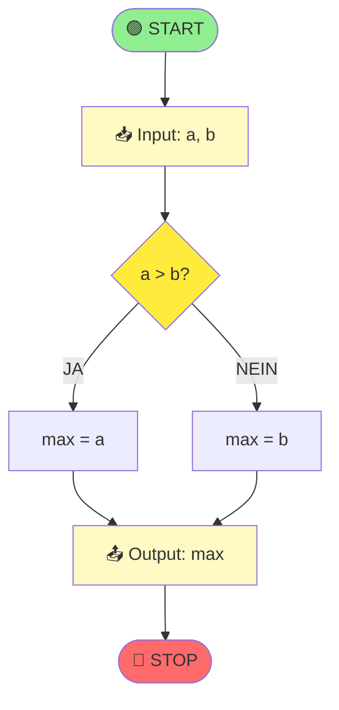

# Notationssprachen

## Warum Notationssprachen?

**Bevor du Code schreibst** (in Java, Python, etc.), solltest du deinen Algorithmus erst mal **klar darstellen**:

- Klarheit: Machst du Fehler, fallen sie VOR dem Coden auf
- Kommunikation: Andere verstehen deine Lösung
- Standardisierung: Jeder versteht die gleiche Notation

**Analoge**: Architekt macht Pläne bevor Haus gebaut wird!

## 1. PAP (Programmablaufplan)

### Definition

Ein **PAP** ist eine **grafische Darstellung** nach DIN 66001.

### Symbole

| Symbol | Name | Bedeutung |
|--------|------|-----------|
| ⭕ | Oval | Start/Stopp |
| ▭ | Rechteck | Aktion/Prozess |
| ◇ | Raute | Entscheidung (Bedingung) |
| Parallelogramm | | Ein-/Ausgabe |
| Pfeil | | Flussrichtung |

### Beispiel: Maximum zweier Zahlen



### Vorteile
- Visuell klar
- Standardisiert
- Für größere Probleme übersichtlich

### Nachteile
- Technisch aufwändig zu zeichnen
- Bei komplexen Algorithmen schnell unübersichtlich (Spaghetti!)

## 2. Struktogramm (Nassi-Shneidermann)

### Definition

Ein strukturiertes **rechteck-basiertes** Diagramm.

### Prinzip

Alles ist in Rechtecken, kein Spaghetti.

### Beispiel: Maximum zweier Zahlen

```
┌────────────────────────┐
│ Input: a, b            │
├────────────────────────┤
│        a > b ?         │
│      /        \        │
│    JA        NEIN      │
│  ┌──┐       ┌──┐       │
│  │m │ =a    │m │ =b    │
│  └──┘       └──┘       │
├────────────────────────┤
│ Output: m              │
└────────────────────────┘
```

### Komplexeres Beispiel: Summe 1..n

```
┌──────────────────────────┐
│ Input: n                 │
├──────────────────────────┤
│ sum ← 0, i ← 1           │
├──────────────────────────┤
│       i ≤ n ?            │
│      /       \           │
│    JA       NEIN         │
│  ┌────────┐              │
│  │sum += i│              │
│  │ i += 1 │              │
│  └────────┘              │
│      ↑                   │
│      └───────────────┐   │
├──────────────────────────┤
│ Output: sum              │
└──────────────────────────┘
```

### Vorteile
- Strukturiert (kein Spaghetti)
- Erzwingt klare Logik
- Leicht zu verstehen

### Nachteile
- Komplexer zu zeichnen als Pseudocode
- Schwierig für sehr große Probleme

## 3. Pseudocode

### Definition

**Quasi-Code** in natürlicher Sprache (oder vereinfachtem Code):

Nicht eine echte Programmiersprache, aber codeähnlich.

### Beispiel: Maximum zweier Zahlen

```
ALGORITHMUS maximum(a, b)
  WENN a > b DANN
    GEBE a ZURÜCK
  SONST
    GEBE b ZURÜCK
  ENDE WENN
ENDE ALGORITHMUS
```

### Komplexeres Beispiel: Summe 1..n

```
ALGORITHMUS summe(n)
  sum ← 0

  FÜR i ← 1 BIS n
    sum ← sum + i
  ENDE FÜR

  GEBE sum ZURÜCK
ENDE ALGORITHMUS
```

### Konventionen

```
← oder =        Zuweisung
FÜR i ← 1 BIS n Zählschleife
WÄHREND ...     Bedingung-gesteuerteSchleife
WENN ... DANN   Entscheidung
GEBE x ZURÜCK   Rückgabewert
EINGABE x       Benutzereingabe
AUSGABE x       Bildschirmausgabe
```

### Vorteile
- Schnell zu schreiben
- Sehr verständlich
- Nähe zum echten Code
- Flexibel

### Nachteile
- Keine standardisierte Notation (variiert)
- Weniger visuell

## Beispiel: Binäre Suche

### PAP-Version
```
          [START]
            │
    [Input: array, target]
            │
      [left=0, right=n-1]
            │
        [left≤right?] ──NEIN──> [return -1]
            │ JA
          [mid = (left+right)/2]
            │
    [array[mid] == target?]
            │JA
     [return mid]
      │
   [array[mid] < target?]
      │ JA                │NEIN
 [left=mid+1]        [right=mid-1]
      │                   │
      └─────────┬─────────┘
                │
            [END]
```

### Struktogramm-Version
```
┌─────────────────────────────────┐
│ left ← 0, right ← n-1           │
├─────────────────────────────────┤
│        left ≤ right ?           │
│       /               \         │
│     JA               NEIN       │
│  ┌─────────────────┐  ┌──────┐  │
│  │ mid = (l+r)/2  │  │ret -1│  │
│  │ [mid]==target? │  └──────┘  │
│  │ /          \   │            │
│  │JA          NEIN│            │
│  │ret mid  /      │            │
│  │       < ==  >  │            │
│  │      /   |  \  │            │
│  │ l+1  keep r-1 │            │
│  └─────────────────┘            │
└─────────────────────────────────┘
```

### Pseudocode-Version
```
ALGORITHMUS binarySearch(array, target)
  left ← 0
  right ← length(array) - 1

  WÄHREND left ≤ right
    mid ← (left + right) / 2

    WENN array[mid] == target DANN
      GEBE mid ZURÜCK
    SONST WENN array[mid] < target DANN
      left ← mid + 1
    SONST
      right ← mid - 1
    ENDE WENN
  ENDE WÄHREND

  GEBE -1 ZURÜCK
ENDE ALGORITHMUS
```

## Auswahl der Notation

### Nutze PAP wenn...
- Das Problem sehr visuell ist
- Mehrere Verzweigungen existieren
- Du für andere darstellst

### Nutze Struktogramm wenn...
- Du strukturiert denken willst
- Das Problem mehr als trivial ist
- Du keine Spaghetti-Code willst

### Nutze Pseudocode wenn...
- Du schnell denken willst
- Der Algorithmus relativ einfach ist
- Du später direkt zu Code übergehen willst

**In der Praxis**: Kombination ist ok! Pseudocode mit Kommentaren als Struktur.

## Zusammenfassung

| Notation | Visuell | Struktur | Flex | Schnell |
|----------|---------|----------|------|---------|
| PAP | ✓✓ | ✓ | ✗ | ✗ |
| Struktogramm | ✓ | ✓✓ | ✗ | ✗ |
| Pseudocode | ✗ | ✓ | ✓✓ | ✓✓ |

**Wichtig**: Die Notation ist Mittel zum Zweck, nicht Selbstzweck! Wähle was für DEIN Problem sinnvoll ist.

Siehe auch: [Concept Map](Concept-Map.md), [Algorithmen](Algorithmen.md)
