# Objektorientierte Programmierung (OOP)

## Kern-Idee

> Programmiere wie die reale Welt funktioniert:
> Objekte mit Eigenschaften und Verhalten

### Beispiel: Student

**Real World**: Ein Student hat einen Namen, ein Alter, kann lernen, schlafen, essen.

**OOP**: Eine Klasse `Student` mit:
- **Attributes** (Eigenschaften): name, alter, noten
- **Methods** (Verhalten): lernen(), schlafen(), essen()

```java
class Student {
  // Attribute
  private String name;
  private int alter;
  private List<Integer> noten;

  // Constructor
  Student(String name, int alter) {
    this.name = name;
    this.alter = alter;
    this.noten = new ArrayList<>();
  }

  // Methods
  void lernen() {
    System.out.println(name + " lernt...");
  }

  void schlaf() {
    System.out.println(name + " schläft...");
  }
}

// Nutzung
Student alice = new Student("Alice", 18);
alice.lernen();  // Output: "Alice lernt..."
```

## Die 4 Säulen

### 1. Encapsulation (Geheimnishaltung)

Verstecke interne Details, exponiere nur Interface:

```java
class BankAccount {
  private double balance;  // ← Private (außen nicht sichtbar)

  public void deposit(double amount) {
    if (amount > 0) {
      balance += amount;  // Validierung!
    }
  }

  public double getBalance() {
    return balance;
  }
}

// Außen:
BankAccount acc = new BankAccount();
acc.deposit(100);  // ✓ Validiert
// acc.balance = -500;  // ✗ Nicht erlaubt! Private!
```

**Vorteil**: Validierung, Konsistenz, Änderungen ohne externe Impact.

### 2. Inheritance (Vererbung)

Eine Klasse kann Eigenschaften von einer anderen erben:

```mermaid
graph TD
    Animal["🐾 Animal<br/>━━━━━━━<br/>+ eat()<br/>+ sleep()"]
    Dog["🐶 Dog<br/>extends Animal<br/>━━━━━━━<br/>+ bark()"]

    Dog -->|erbt von| Animal

    style Animal fill:#fff9c4
    style Dog fill:#bbdefb
```



**Vorteil**: Code-Wiederverwendung, gemeinsame Basis.

### 3. Polymorphism (Vielgestaltigkeit)

Mehrere Klassen können die gleiche Methode unterschiedlich implementieren:

```java
abstract class Shape {
  abstract void draw();
}

class Circle extends Shape {
  void draw() { System.out.println("Zeichne Kreis"); }
}

class Square extends Shape {
  void draw() { System.out.println("Zeichne Quadrat"); }
}

// Polymorphe Nutzung
List<Shape> shapes = Arrays.asList(new Circle(), new Square());
for (Shape s : shapes) {
  s.draw();  // ← Ruft richtige Implementation auf
}
```

Output:
```
Zeichne Kreis
Zeichne Quadrat
```

**Vorteil**: Flexibilität, einfach neue Types hinzufügen.

### 4. Abstraction (Abstraktion)

Exponiere nur relevante Details:

```java
// Abstraktion: User sieht nicht die internen Details
public interface Animal {
  void eat();
  void sleep();
}

// Implementierung: Details versteckt
class Dog implements Animal {
  public void eat() {
    // Komplexe Logik hier
    fetchFood();
    chew();
    swallow();
  }

  private void fetchFood() { /* ... */ }
  private void chew() { /* ... */ }
  private void swallow() { /* ... */ }
}
```

**Vorteil**: Einfaches Interface, komplexe Implementierung versteckt.

## Klasse vs Methode

**Die offene Frage aus den Notizen!**

### Klasse

Eine **Klasse** ist ein **Bauplan** für Objekte:

```java
class Student {
  // Attribute
  String name;
  int alter;

  // Constructor
  Student(String name, int alter) {
    this.name = name;
    this.alter = alter;
  }
}
```

- Definiert Struktur (welche Attribute)
- Definiert Verhalten (welche Methoden)
- Ist nicht selbst ein Objekt, sondern ein Plan

### Methode

Eine **Methode** ist eine **Funktion innerhalb einer Klasse**:

```java
class Student {
  // Methode: Funktion die zu Klasse gehört
  void lernen() {
    System.out.println("Ich lerne...");
  }
}
```

- Definiert Verhalten
- Hat Zugriff auf Klassenvariablen
- Wird auf Objekten aufgerufen

### Zusammenhang

```java
class Student {           // ← KLASSE (Bauplan)
  String name;            // ← Attribute

  void lernen() {         // ← METHODE (Verhalten)
    System.out.println("Ich lerne");
  }
}

// Nutzung:
Student alice = new Student();  // ← Objekt (Instanz der Klasse)
alice.lernen();                  // ← Methode auf Objekt aufrufen
```

**Analoge**:
- **Klasse** = Rezept
- **Methode** = Schritt im Rezept
- **Objekt** = Das gekochte Gericht

## Best Practices

1. **Single Responsibility**: Eine Klasse eine Aufgabe
2. **DRY** (Don't Repeat Yourself): Code nicht duplizieren
3. **SOLID** Prinzipien folgen
4. **Meaningful names**: Klassen-Namen sind Nouns, Method-Namen sind Verbs

```java
// ✓ Gut
class UserManager {
  void saveUser(User u) { ... }
}

// ✗ Schlecht
class Thing {
  void doStuff() { ... }
}
```

Siehe auch: [Einfuehrung Programmiermodelle](Einfuehrung.md)
