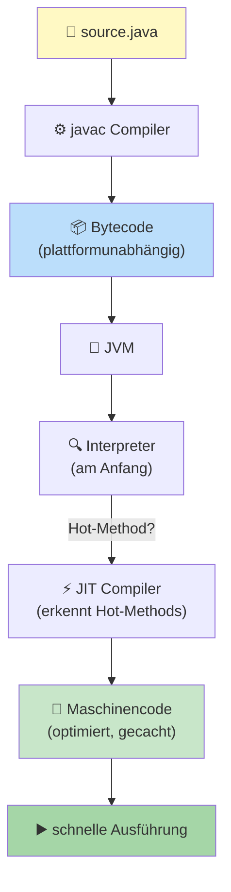

# Compiler vs Interpreter: Implementation Types

## Das zentrale Problem

Du schreibst Code in Java. Die CPU versteht nur Maschinencode.

```
Frage: Wie geht die CPU von deinem Java-Code zu Maschinencode?
```

**Antwort**: Drei Wege!

## Type 1: Compiler Implementation (Compile-Time)

**Ansatz**: Übersetz den Code VOR der Ausführung zu Maschinencode.


**Beispiele**: C, C++

### Workflow

```bash
$ gcc main.c -o main      # Compilation (einmalig)
$ ./main                  # Ausführung (schnell)
```

**Prozess**:
1. Compiler liest `main.c`
2. Übersetzt zu Maschinencode für diese CPU (z.B. x86-64)
3. Speichert in `main` (Binär-Datei)
4. Ausführung: CPU führt `main` aus

**Kompilation schritte** (vereinfacht):
```
Source Code
    ↓ Lexikalische Analyse (Scanner)
Token Stream
    ↓ Syntaxanalyse (Parser)
Abstract Syntax Tree (AST)
    ↓ Codegenerierung
Maschinencode
```

### Vorteile
- ✓ **Schnell**: Code ist schon übersetzt
- ✓ **Optimiert**: Compiler kann Optimierungen machen
- ✓ **Binärdatei**: Nur `main` verteilen, nicht Source Code

### Nachteile
- ✗ **Nicht portabel**: `gcc` auf Windows ≠ `gcc` auf Linux
  - Musst für jede Plattform kompilieren
- ✗ **Lange Development-Cycle**: Change → Recompile → Test
- ✗ **Platformabhängig**: `gcc file.c` auf Windows → Windows Binary
  - Auf Linux gibt's einen anderen Binary!

## Type 2: Pure Interpretation (Runtime)

**Ansatz**: Interpretiere den Code während der Ausführung.


**Beispiele**: Python, JavaScript, Ruby

### Workflow

```bash
$ python main.py
```

**Prozess**:
1. Interpreter liest `main.py` Zeile für Zeile
2. Überprüft Syntax
3. Führt sofort aus

```
main.py
   ↓ Interpreter liest Zeile 1
Zeile 1 ausführt
   ↓ Interpreter liest Zeile 2
Zeile 2 ausführt
   ↓ ...
```

### Vorteile
- ✓ **Portabel**: Gleicher Code auf Windows, Linux, macOS
  - (Solange Interpreter installiert ist)
- ✓ **Schnelles Testing**: Change → Ausführen → Test
- ✓ **Dynamisch**: Können Code zur Runtime ändern/generieren

### Nachteile
- ✗ **Langsam**: Wird bei jedem Ausführen neu interpretiert
- ✗ **Interpretation-Overhead**: Jede Zeile muss gelesen, geparst, ausgeführt werden
- ✗ **Source Code erforderlich**: Distribuieren des Source Code nötig (IP-Problem)

## Type 3: Hybrid Implementation (JIT-Compilation)

**Ansatz**: Kombiniere beide! Übersetz zur Runtime, cache optimiert code.



**Beispiele**: Java, C#, C++, Go (in Teilen)

### Workflow (Java)

```bash
$ javac Main.java          # Compilation (einmalig)
Main.java → Main.class (Bytecode)

$ java Main                # Ausführung (mit JVM)
Main.class → [JVM] → interpretiert + compiliert → schnell!
```

**Was ist die JVM?**

JVM = Java Virtual Machine. Eine VM die:
1. `.class` Bytecode liest
2. Interpretiert (am Anfang)
3. Hot-Methods compiliert zu Maschinencode (JIT)
4. Cacht den Maschinencode

### Detailliert: JIT Compilation

```
JVM startet:

Erste Ausführung:
┌─────────────────────┐
│ Method interpretiert │  ← Langsam
└─────────────────────┘
         ↓
JVM merkt: "Diese Method wird oft aufgerufen!"
         ↓
┌─────────────────────────────┐
│ JIT-Compiler compiliert zu  │
│ optimiertem Maschinencode   │
└─────────────────────────────┘
         ↓
Nächste Ausführung:
┌─────────────────────┐
│ Method (Maschinencode)│  ← Schnell!
└─────────────────────┘
```

### Vorteile
- ✓ **Portabel**: Ein `.class` File auf allen Plattformen
- ✓ **Schnell**: JIT optimiert hot-paths
- ✓ **Sicher**: Bytecode wird überprüft
- ✓ **Source Code nicht nötig**: Nur `.class` verteilen

### Nachteile
- ✗ **JVM erforderlich**: Nutzer braucht Java installiert
- ✗ **Warm-up Zeit**: Am Anfang langsamer (JIT muss compilieren)
- ✗ **Memory**: JVM braucht RAM

## Vergleich

| Aspekt | Compiler | Interpreter | Hybrid |
|--------|----------|-------------|--------|
| **Ausführungszeit** | Schnell | Langsam | Schnell (nach Warm-up) |
| **Entwicklung** | Langsam (Compile) | Schnell | Mittel |
| **Portabilität** | Niedrig | Hoch | Hoch |
| **Source Code** | Optional | Erforderlich | Optional |
| **Memory** | Niedrig | Mittel | Hoch (JVM) |
| **Beispiele** | C, C++ | Python, JS | Java, C# |

## Visual: Der Prozess

### Compiler (C)

```
step-by-step nur kompilier_ausgabe bild
main.c → [gcc] → main (binary)
                   ↓
                 [CPU]
                   ↓
                Ausführung
```

### Interpreter (Python)

```
main.py → [python] → read line 1
                     execute line 1
                     read line 2
                     execute line 2
                     ...
```

### Hybrid (Java)

```
Main.java → [javac] → Main.class (Bytecode)
                       ↓
                      [JVM]
                       ├─ Interpret (am Anfang)
                       ├─ JIT-Compile (hot methods)
                       └─ Cache Maschinencode
                       ↓
                    Schnelle Ausführung
```

## Warumm Java (Hybrid)?

**Wir nutzen Java in diesem Kurs WEIL:**

1. **Portabel**: Write once, run anywhere
2. **Schnell**: JIT macht es im Laufen schnell
3. **Sicher**: Bytecode wird überprüft
4. **Professionell**: Wirklich in Industrie genutzt
5. **OOP-fokussiert**: Klassen von Anfang an

Java ist der Goldstandard zwischen "einfach lernen" (Python) und "professionell nutzen" (C++).

## Zusammenfassung

```
Compiler:  Schnell, nicht portabel  (C, C++)
Interpreter: Portabel, langsam      (Python, JS)
Hybrid:    Beste Beiden! (Java, C#)
```

Die meisten modernen Sprachen nutzen Hybrid!

Siehe auch: [JIT-Compilation](JIT-Compilation.md), [Lexikalische Analyse](Lexikalische-Analyse.md)
