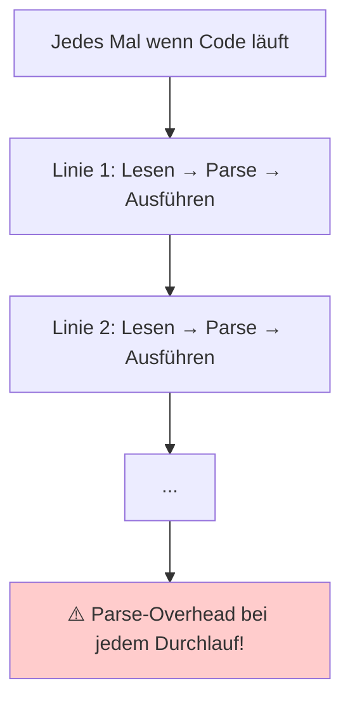
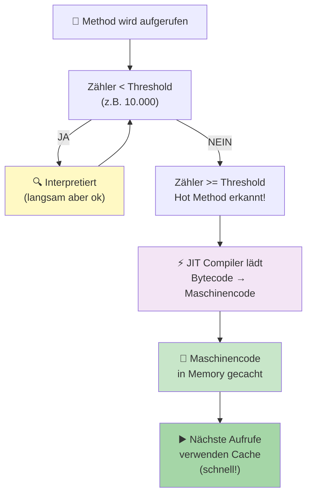

# JIT-Compilation (Just-In-Time)

## Das Problem: Interpretation ist langsam



## Die Lösung: JIT

**JIT = Just-In-Time Compilation**

> Wenn ein Algorithmus oft läuft, compiliere ihn zu Maschinencode!

Dann beim nächsten Aufruf: kein Parsing nötig, direkt Maschinencode!

## Wie funktioniert's?

### JIT Compilation Pipeline



### Schritt 1: Profiling (Monitoring)

JVM beobachtet welche Methods oft aufgerufen werden:

```
Method fibonacci() wurde schon 5000x aufgerufen
  → Das ist eine "Hot Method"!
  → Candidate für JIT-Compilation
```

### Schritt 2: JIT Compilation

JIT-Compiler kompiliert diese Method zu Maschinencode:

```
Bytecode (fibonacci Method):
  iload_1
  iload_2
  iadd
  ...

       ↓ JIT Compiler

Maschinencode (x86-64):
  mov rax, [rbp+16]  ; load param 1
  mov rbx, [rbp+24]  ; load param 2
  add rax, rbx       ; add
  ...
```

### Schritt 3: Caching

Der Maschinencode wird gecacht:

```
Beim Aufrufen:
  ├─ Erste Aufrufe (< Threshold):
  │  └─ Interpretiert (langsam aber ok für wenige Aufrufe)
  │
  └─ Nach Threshold (z.B. 10000 Aufrufe):
     └─ JIT compiliert zu Maschinencode (schnell!)
        └─ Gecacht in Memory
        └─ Nächste Aufrufe nutzen Maschinencode
```

### Schritt 4: Adaptive Optimization

JIT kann auch optimieren:

```
Bytecode:
  List items = ...
  for (Item item : items) {
    item.process();
  }

JIT sieht: "Immer ArrayList, nie LinkedList"
  → Optimiert für ArrayList-Zugriff

Oder: "Diese Method wird mit Integer 5 aufgerufen, nie anderem"
  → Specialisiert für Integer 5!
```

## Performance Graph

```
              Execution Time (ms)
              ↑
              │     Compiled (C++)
              │     ═════════════════ (schnell, konstant)
              │    /
              │   /
              │  /  JVM mit JIT
              │ /   ╱╱╱╱╱╱╱╱╱╱╱╱
              │/════════════════════ (schnell nach Warm-up)
              │
              │╱╱╱╱╱ Pure Interpretation
              │╱╱╱╱╱ (langsam, konstant)
              │
              └────────────────────────→ Time (seconds)
                    Warm-up Phase
```

**Zu Beginn**: Interpretation ist langsamer
**Nach Warm-up**: JIT-compilierter Code ist schnell wie C++!

## Beispiel: Fibonacci

```java
int fib(int n) {
  if (n <= 1) return n;
  return fib(n-1) + fib(n-2);
}

// Aufgerufen 10 Millionen Male
for (int i = 0; i < 10_000_000; i++) {
  fib(5);
}
```

**Ohne JIT**: Jedes Mal interpretiert → **Sehr langsam** (Minuten)

**Mit JIT**:
- Erste 5000 Aufrufe: Interpretiert
- Dann: JIT compiliert `fib()` zu Maschinencode
- Danach: Maschinencode läuft → **Sehr schnell** (Sekunden!)

## JIT in Java

Die Java HotSpot VM macht JIT:

### Flags zum Steuern

```bash
# JIT aktiviert (default)
java MyApp

# JIT deaktiviert
java -Xint MyApp          # Nur Interpretation

# Threshold erhöhen (mehr Aufrufe bevor JIT)
java -XX:CompileThreshold=50000 MyApp

# Anschauen was JIT macht
java -XX:+PrintCompilation MyApp   # Zeigt was compiliert wird
java -XX:+PrintInlining MyApp      # Zeigt Inlining
```

### Output Beispiel

```
  1234  org.example.Fibonacci::fib (23 bytes)
  1235  java.util.ArrayList::get (35 bytes)
  ...
```

"Method `fib` wurde JIT-compiliert"

## Inlining (Optimization)

JIT macht oft auch "Inlining":

```
Original:
  result = fib(n-1) + fib(n-2);

JIT sieht: fib ist klein und oft aufgerufen
  → Expandiere fib inline (kopiere Code rein)

Ergebnis:
  result = (n-1 <= 1 ? n-1 : fib(n-2) + fib(n-3))
           + (n-2 <= 1 ? n-2 : fib(n-3) + fib(n-4));

Weniger Function-Call Overhead!
```

## Deoptimization

Manchmal macht JIT auch "falsche" Annahmen:

```
JIT hatte angenommen:
  "Diese Variable ist immer ein Integer"

Aber dann kommt:
  "Äh, jetzt ist es ein Long!"

JIT: "Mist, meine Optimierungen sind ungültig"
  → Fallback zu Interpretation
  → Re-JIT mit neuen Assumptions
```

## Wichtig zu verstehen

**JIT ist nicht magisch!**

- JIT hilft vor allem bei:
  - Sich wiederholender Code
  - Häufig aufgerufene Methods
  - Großen Datenmengen

- JIT hilft NICHT bei:
  - Code der nur 1x läuft
  - Bad Algorithms (JIT kann O(n²) nicht zu O(n) machen!)

**Wenn dein Code langsam ist:**
1. Check dein Algorithm (ist es richtig schnell?)
2. Check Datenstrukturen (richtige Wahl?)
3. Erst DANN JIT-Tweaking

## Zusammenfassung

- **JIT**: Kompiliere häufig aufgerufenen Code zur Runtime
- **Adaptive**: Passt sich an welcher Code häufig ist
- **Performance**: Nach Warm-up schnell wie kompilierte Sprachen
- **Trade-off**: Startup ist langsamer (braucht Zeit zum Compilieren)

Darum ist Java often "langsam" am Anfang, aber dann schnell!

Siehe auch: [Compiler vs Interpreter](Compiler-Interpreter.md)
