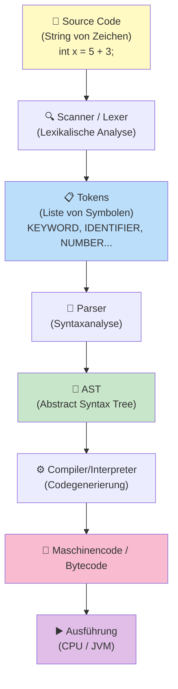
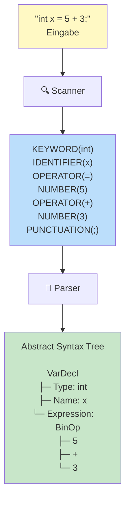

# Lexikalische Analyse & Parsing

## Der Weg vom Code zur Ausführung



Wir schauen hier die ersten zwei Schritte an (Scanner und Parser).

## Schritt 1: Lexikalische Analyse (Scanning)

### Was macht der Scanner?

Der **Scanner** liest den Source Code als Zeichen-Kette und teilt ihn in **Tokens** auf.

### Beispiel

Input:
```java
int x = 5 + 3;
```

Scanner erkennt:
- `int` → **Keyword** (reserviertes Wort)
- ` ` (space) → **Whitespace** (ignorieren)
- `x` → **Identifier** (Variablenname)
- ` ` → **Whitespace** (ignorieren)
- `=` → **Operator**
- ` ` → **Whitespace** (ignorieren)
- `5` → **Number** (Literal)
- ` ` → **Whitespace** (ignorieren)
- `+` → **Operator**
- ` ` → **Whitespace** (ignorieren)
- `3` → **Number** (Literal)
- `;` → **Punctuation**

Token-Stream:
```
[KEYWORD(int), IDENTIFIER(x), OPERATOR(=), NUMBER(5),
 OPERATOR(+), NUMBER(3), PUNCTUATION(;)]
```

### Token-Typen

| Typ | Beispiele |
|-----|----------|
| **Keyword** | `int`, `if`, `while`, `class`, `return` |
| **Identifier** | `x`, `myVariable`, `foo123` |
| **Literal** | `42`, `3.14`, `"hello"`, `true` |
| **Operator** | `+`, `-`, `*`, `/`, `=`, `==`, `<` |
| **Punctuation** | `{`, `}`, `(`, `)`, `,`, `;` |
| **Whitespace** | ` `, `\n`, `\t` (meistens ignoriert) |
| **Comment** | `// comment`, `/* block */` (ignoriert) |

### Der Scanner-Prozess

```
Input: "int x = 5;"

Position 0: 'i'
  → Lesen 'i', 'n', 't'
  → "int" ist Keyword
  → Token hinzufügen: KEYWORD(int)

Position 3: ' '
  → Whitespace
  → Ignorieren

Position 4: 'x'
  → Lesen 'x'
  → "x" ist Identifier (nicht Keyword)
  → Token hinzufügen: IDENTIFIER(x)

... und so weiter
```

## Schritt 2: Syntaxanalyse (Parsing)

### Was macht der Parser?

Der **Parser** nimmt den Token-Stream und überprüft ob die **Struktur** korrekt ist.

Input:
```
[KEYWORD(int), IDENTIFIER(x), OPERATOR(=), NUMBER(5),
 OPERATOR(+), NUMBER(3), PUNCTUATION(;)]
```

Parser überprüft:
```
"int x = 5 + 3;"

Regel: Statement = Type Identifier "=" Expression ";"

✓ Type (int)
✓ Identifier (x)
✓ "=" (Operator)
✓ Expression (5 + 3)
✓ ";" (Punctuation)

→ Syntaktisch korrekt!
```

### AST (Abstract Syntax Tree)

Der Parser baut einen Baum (AST):

```
         VarDecl
        /    |   \
    Type  Name  Expression
     int    x      BinOp
                   / | \
                 5  +  3
```

**Was bedeutet dieser Baum:**
"Deklariere Variable x vom Typ int mit Initialwert 5+3"

### Fehler erkennen

Parser checkt auch Syntax-Fehler:

```java
int x = 5 +;  // ← Fehler! "+" braucht rechten Operand
```

Token-Stream:
```
[KEYWORD(int), IDENTIFIER(x), OPERATOR(=), NUMBER(5),
 OPERATOR(+), PUNCTUATION(;)]  ← Aha! Nach + kommt ;
```

Parser: "Erwartet Expression nach +, aber bekomme ;"
→ **Syntax Error!**

## Unterschied: Scanner vs Parser

| Aspekt | Scanner | Parser |
|--------|---------|--------|
| **Liest** | Zeichen | Tokens |
| **Prüft** | Lexikalische Regeln | Syntaktische Regeln |
| **Fehler** | Unbekannte Zeichen | Ungültige Struktur |
| **Output** | Token-Stream | AST |

**Scanner**: "Ist `int` ein Keyword?" ✓
**Parser**: "Ist `int x = 5 + ;` eine gültige Deklaration?" ✗

## Beispiel: Ungültige Semantik (NICHT im Parser!)

```
int x = "hello";   // Scanner ✓, Parser ✓
                   // ABER: Compiler ✗ (Type mismatch)
```

Das ist kein Syntax-Fehler, sondern ein **Semantic-Fehler**.

(Wird später im Compiler geprüft, nicht im Parser)

## Grammatik (Formal)

Parser nutzt formale **Grammatiken** (BNF = Backus-Naur Form):

```
Statement ::= Type Identifier "=" Expression ";"
Type ::= "int" | "float" | "String" | ...
Expression ::= Number | Identifier | BinOp
BinOp ::= Expression Operator Expression
Operator ::= "+" | "-" | "*" | "/" | ...
Number ::= [0-9]+
Identifier ::= [a-zA-Z][a-zA-Z0-9]*
```

Der Parser nutzt diese Regeln um zu überprüfen ob Input gültig ist.

## Zusammenfassung


                   / | \
                 5  +  3

↓ Semantic Check + Code Generation

Maschinencode / Bytecode
```

Dieser Prozess ist **für JEDE Programmiersprache ähnlich**!

Siehe auch: [Compiler vs Interpreter](Compiler-Interpreter.md)
