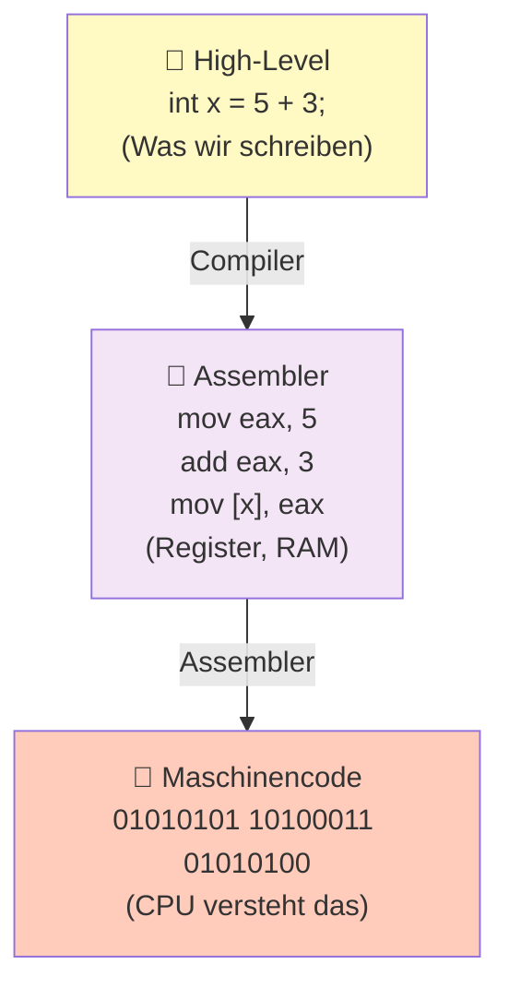
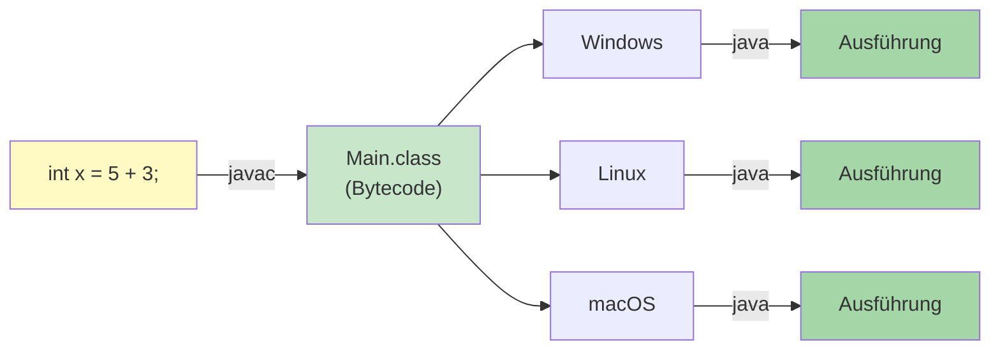

# Maschinennähe

## Von Mensch zu Machine



## Ebenen der Maschinennähe

### Level 1: Maschinensprache

**Direkt für CPU**, Binär:

```
01010101 00110100 01010100 ...
```

**Wer schreibt das?** Niemand direkt. Das macht der Assembler.

**Vorteile**:
- ✓ Schnell (keine Übersetzung)
- ✓ Direkt auf Hardware

**Nachteile**:
- ✗ Unlesbar für Menschen
- ✗ Portabel (CPU-spezifisch)
- ✗ Fehleranfällig

### Level 2: Assembler

**Symbolische Maschinensprache**, lesbar:

```
mov eax, 5          ; Zahl 5 in Register eax
add eax, 3          ; Addiere 3 zu eax
mov [ebx], eax      ; Speichere in Memory
```

**Register** (schnelle Speicher in CPU):
- `eax`, `ebx`, `ecx`, `edx` (32-bit)
- `rax`, `rbx`, `rcx`, `rdx` (64-bit)

**Operationen** (ALU = Arithmetic Logic Unit):
- `mov` — Daten verschieben
- `add`, `sub`, `mul`, `div` — Rechnen
- `cmp` — Vergleichen
- `jmp` — Springen (wie GOTO)

**Wer schreibt das?** Selten Menschen. Meist Compiler.

**Vorteile**:
- ✓ Lesbar
- ✓ Volle Kontrolle
- ✓ Schnell (direkt CPU-Befehle)

**Nachteile**:
- ✗ Kompliziert (Register managen)
- ✗ CPU-spezifisch (x86, ARM, etc.)
- ✗ Wenig Abstraktion

### Level 3: Hochsprachenprogrammierung

**Abstraktion über CPU-Spezifiken**:

```java
int x = 5 + 3;
```

**Compiler/Interpreter macht die Umwandlung zu Assembler/Maschinencode!**

**Wer schreibt das?** Wir alle! Das ist unser Job.

**Vorteile**:
- ✓ Lesbar
- ✓ Portabel (gleicher Code auf x86, ARM, etc.)
- ✓ Abstraktion (nicht-Details sichtbar)
- ✓ Produktiv (schneller programmieren)

**Nachteile**:
- ✗ Langsamer (Übersetzungs-Overhead)
- ✗ Weniger Kontrolle über Hardware

## Beispiel: Summe berechnen

### Hochsprache (Java)
```java
int sum = 0;
for (int i = 1; i <= 10; i++) {
    sum += i;
}
```

### Assembler (x86-64 vereinfacht)
```asm
mov eax, 0          ; sum = 0 (eax Register)
mov ecx, 1          ; i = 1 (ecx Register)

loop:
cmp ecx, 10         ; Vergleiche i mit 10
jg end              ; Wenn größer, springe zu end
add eax, ecx        ; sum += i
add ecx, 1          ; i += 1
jmp loop            ; Springe zurück zu loop

end:
; eax enthält jetzt sum = 55
```

### Maschinencode
```
01001000 11000111 11000011 00000000 00000000 00000000
01001000 11000111 11000001 00000001 00000000 00000000
00111001 11001001 01001111 00000100
...
```

**Derselbe Algorithmus, drei Ebenen!**

## Turing Machine

**Wichtig**: Alan Turing hat bewiesen:

> Alles, was berechenbar ist, kann mit einfachen Operationen gemacht werden:
> - Wert speichern
> - Wert auslesen
> - Einfache Operationen (Add, Sub, If)

Das heißt: **Hochsprachen sind genauso mächtig wie Assembler!**

Nur die Abstraktion ist anders.

## Portabilität

### Maschinensprache
```
Windows x86:    01010101 10100011
Linux ARM:      10100011 01010101 (anders!)
macOS x86:      01010101 10100011
```

**Problem**: Jede CPU braucht andere Befehle!

### Hochsprache


**Gleicher Code läuft überall!** (Dank JVM = Java Virtual Machine)

Das ist der große Vorteil von Hochsprachen.

## Schlicht Zusammenfassung

| Ebene | Format | Schreibt es? | Lesbar | Schnell | Portabel |
|-------|--------|-------------|--------|---------|----------|
| Maschinensprache | 01010101 | Assembler | ✗ | ✓✓ | ✗ |
| Assembler | `mov eax` | Compiler | ~ | ✓ | ✗ |
| Hochsprache | `int x = 5` | Menschen | ✓✓ | ✗ | ✓✓ |

**Für diesen Kurs**: Wir schreiben Hochsprache (Java). Der Compiler kümmert sich um den Rest!

Siehe auch: [Compiler vs Interpreter](Compiler-Interpreter.md)
